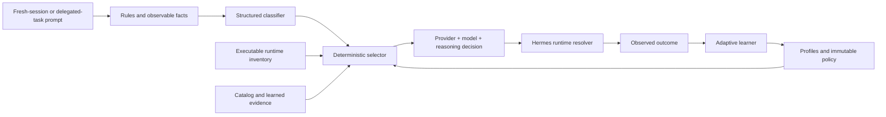
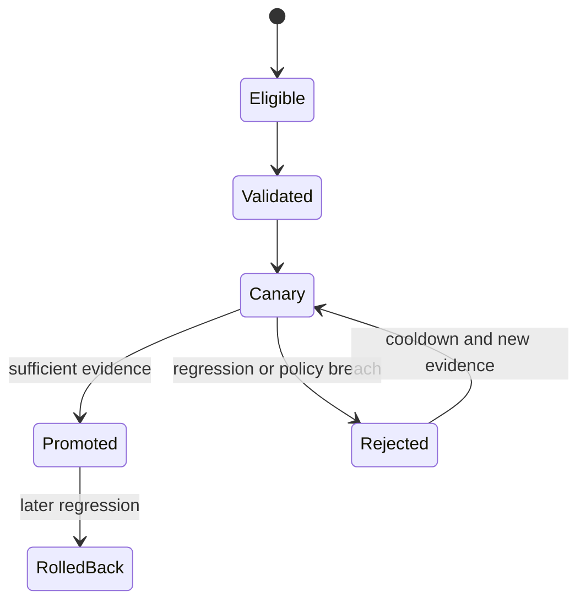

# Hermes Auto Model Routing Design

**Date:** 2026-07-15

**Status:** Approved design; implementation planning follows separately

**Target baseline:** `9thLevelSoftware/hermes-agent` `main` at `ff31150a318617993374acc9cbd392781f84d2e1`

**Delivery target:** fork-local, self-contained Hermes plugin with an extraction-ready package boundary

**Research cutoff:** 2026-07-15

## 1. Decision

Build Hermes's equivalent of an `Auto` model selector as an opt-in plugin in this fork. The feature makes semantic routing decisions at the two cache-safe boundaries in scope:

1. before the first model call of a fresh session; and
2. before constructing each delegated child agent.

The router does not switch the main model during an active conversation for semantic/task optimization. An already-recorded fallback may replace an unavailable runtime as an explicit cache-reset event; it is not a new Auto classification. The router does not expose model selection to the parent model through `delegate_task` arguments. A resumed session reuses its recorded route.

Selection is driven by:

- user-defined named route profiles rather than a fixed three-tier ladder;
- an optional ordered rank for each profile;
- deterministic rules and observable runtime facts;
- a configurable classifier that returns structured task requirements rather than a model name;
- deterministic capability filtering and profile scoring;
- targets that specify provider, model, and per-target reasoning defaults and bounds;
- a primary target plus ordered fallbacks;
- provenance-tracked catalog evidence and verified local outcomes; and
- conservative autonomous adaptation inside an immutable user-approved policy envelope.

Only runtimes that Hermes can actually execute are eligible. That means verified configured provider runtimes, subscription models whose access can be established, and already-installed local models that pass backend and hardware compatibility checks. An external catalog entry can improve ranking evidence but can never establish eligibility by itself.

Mixture of Agents (MoA) is excluded from the first version. The target contract remains extensible so a named MoA preset can be evaluated later without redesigning the routing pipeline.

## 2. Motivation

Hermes can access far more providers, authentication modes, custom endpoints, local runtimes, and models than a conventional IDE assistant. A hard-coded `light / standard / heavy` table is therefore not enough. The correct runtime depends on more than nominal task complexity:

- required modalities and tool support;
- context and output limits;
- domain suitability;
- reasoning support and useful reasoning range;
- reliability and provider availability;
- subscription entitlement or credential availability;
- local hardware and installed models;
- cost, latency, and quality priorities; and
- evidence gathered from this user's actual workload.

There is also no provider-independent universal definition of the "best" model. The system must make tradeoffs explicit, retain source provenance, distinguish access from quality, and let the user establish hard authority limits before granting adaptation autonomy.

The desired product experience has two modes:

- **Configuration mode:** a chat skill backed by a plugin CLI asks questions, inventories executable runtimes, explains ranked recommendations, dry-runs representative tasks, previews changes, and obtains approval before establishing or editing the immutable policy envelope.
- **Runtime mode:** routing is silent and automatic. It never asks clarification questions merely because classification confidence is low. Every decision remains inspectable afterward.

## 3. Goals and success criteria

### 3.1 Product goals

1. Select an appropriate runtime for fresh sessions and delegated children without breaking Hermes prompt caching.
2. Support arbitrary configured providers, subscription access paths, custom providers, and installed local models through Hermes's canonical runtime resolution.
3. Let users define one or more non-exclusive named profiles such as `fast`, `coding`, `vision`, or `deep` without forcing every task onto a one-dimensional ladder.
4. Select provider, model, and reasoning effort as one explainable decision.
5. Make setup conversational and evidence-backed without adding a permanent model-facing management tool.
6. Adapt automatically from outcomes, including discovery and canary evaluation of newly eligible runtimes, while respecting immutable user limits.
7. Fail safely to normal Hermes behavior whenever the router, classifier, catalog, state store, or compatibility adapter cannot operate.
8. Keep the implementation isolated enough to extract into a standalone repository later.

### 3.2 Acceptance-level outcomes

The feature is successful when:

- a new session can be routed before its first provider call and retains that route unless the user manually switches or a recorded runtime failover starts a declared cache-reset epoch;
- each task in a delegation batch can receive a different internal route without changing the `delegate_task` schema;
- later turns in an active session make no new model-selection decision;
- a resumed session does not get reclassified;
- inaccessible catalog models never appear as selectable or recommended runtimes;
- every decision can explain the requirements, policy gates, rejected candidates, scores, target, reasoning effort, catalog revision, and adaptive revision involved;
- classifier or catalog failure does not block a user turn;
- adaptive decisions cannot cross the immutable selection-policy envelope;
- canary regressions roll back automatically; and
- disabling or failing to load the plugin restores unmodified Hermes behavior.

## 4. Constraints and non-goals

### 4.1 Hermes invariants

The design preserves these load-bearing Hermes properties:

- **Prompt-cache stability:** Auto never semantically reroutes an active route epoch. An explicit manual model switch or recorded provider failover is a visible cache-reset boundary, not an ordinary Auto decision.
- **Narrow model-tool surface:** no new core model tool and no routing fields in `delegate_task`.
- **Canonical provider behavior:** runtime identity, credentials, API mode, provider profiles, credential pools, fallbacks, and reasoning translation remain Hermes responsibilities.
- **Strict message semantics:** the router injects no synthetic chat turns and does not mutate history.
- **Behavioral configuration:** user-facing settings live under the plugin's entry in `config.yaml`; secrets remain in Hermes credential stores.
- **Local-first evidence:** no outbound telemetry or usage attribution is introduced.

### 4.2 Explicit non-goals

The initial design does not include:

- mid-conversation automatic model switching;
- agent-selected model, provider, or reasoning arguments in `delegate_task`;
- automatic provider signup or credential creation;
- automatic download or installation of local models;
- recommendations for runtimes the user cannot execute;
- MoA routing or MoA quality claims;
- runtime clarification prompts for low-confidence decisions;
- toolset changes based on the selected model;
- system-prompt mutation based on the selected model;
- hidden storage of raw prompts or responses in the learning database;
- cross-profile evidence sharing without explicit export/import; or
- an upstream contribution in its fork-local form.

## 5. Verified current state and prior art

### 5.1 Hermes delegation

`tools/delegate_tool.py` already provides the correct execution substrate for routed children:

- every child is an isolated `AIAgent`;
- child creation already projects provider runtime, credentials, API mode, reasoning, budgets, tools, progress, and cost accounting;
- configured delegation provider/model overrides resolve through Hermes's runtime provider machinery;
- asynchronous delegation has durable operations, recovery, delivery, cancellation, and lifecycle handling; and
- delegation and gateway/TUI paths have substantial focused tests.

The existing implementation resolves one configured delegation runtime for a batch. The plugin must choose a runtime per task internally before child construction while retaining all downstream Hermes behavior.

Hermes history also makes the trust boundary clear: model-facing per-task runtime controls were deliberately removed, and current descriptions state that subagent runtime selection is operator configuration rather than an agent argument. This design follows that intent by keeping routing trusted, internal, and schema-free.

### 5.2 Existing Hermes Auto prototype

The unmerged branch `upstream/bb/model-routing` contains commits `57177544f` and `69f429189`. The first implements cache-safe routing at fresh-session and delegation boundaries; the second restricts it to Nous Portal. The prototype validates two core choices in this design:

1. fresh-session and child-construction boundaries avoid cache invalidation; and
2. classification can run through a cheap auxiliary model and fail back safely.

It is not sufficient for this feature because it has fixed `light / standard / heavy` tiers, ultimately supports only Nous Portal targets, and does not model per-target reasoning, executable inventory, profile advice, provenance, or adaptation.

### 5.3 Reference routing plugin

[`b3nw/hermes-delegate-routing`](https://github.com/b3nw/hermes-delegate-routing) demonstrates a viable standalone package, plugin entry point, signature guards, idempotent patching, per-task context isolation, and tests. Its explicit `tasks[].model/provider` interface is intentionally not carried forward. The useful packaging and compatibility techniques should be retained with attribution; routing decisions move inside the plugin.

### 5.4 Existing model metadata

`agent/models_dev.py` already exposes broad model metadata including tool/reasoning/vision support, context and output limits, pricing, release/status data, and modalities. That metadata is valuable for capability validation, cost estimates, and stale-model warnings. It does not provide a trustworthy provider-neutral intelligence or task-complexity rank, so the router must not infer model quality from metadata fields alone.

### 5.5 MoA

Hermes MoA is not a stub. It has named presets, per-slot provider/model/reasoning configuration, parallel reference execution, an acting aggregator, partial-failure handling, cost and usage accounting, cache controls, tracing, and focused tests.

MoA solves a different problem: it gathers multiple model perspectives and synthesizes them. It multiplies cost and latency, and its benefit must be established empirically for a task class. It is therefore not a classifier and not a v1 route target.

### 5.6 Commercial Auto behavior

GitHub documents Auto model selection as combining task optimization with model health and availability, and states that routing occurs at natural cache boundaries rather than switching arbitrarily inside a session. Cursor describes Auto as choosing a suitable reliable model and reacting to demand or degraded performance. These products support the high-level direction, but their smaller and more controlled model pools do not solve Hermes's provider and configuration problem.

## 6. Architectural overview

The fork contains a self-contained plugin under a dedicated directory such as `plugins/auto_routing/`. The routing core depends on small protocols and does not import Hermes private internals. Only versioned adapter modules import Hermes-specific boundary, inventory, resolver, session, or provider APIs.



### 6.1 Components

#### Hermes compatibility adapters

Adapters expose Hermes runtime/inventory facades. They make new semantic routing decisions only at:

- fresh-session initialization before the stable prompt/client's first call; and
- delegated-child runtime resolution before each child is constructed.

They project a `RoutingDecision` into Hermes runtime fields and then return control to Hermes. A separate compatibility wrapper may observe an existing Hermes runtime-failover transition solely to consume the decision's already-recorded fallback target, apply that target's reasoning policy, and record a cache-reset epoch. It does not classify or choose a new semantic profile at failure time.

Adapters do not implement provider clients, credential rotation, or provider-specific reasoning translation. Auto-routed sessions do not implicitly append Hermes's global fallback list: the recorded profile fallback chain is authoritative after policy validation. When Auto is bypassed, Hermes's original fallback behavior remains unchanged.

Adapters are versioned, idempotent, feature-probed, and signature-guarded. A future native Hermes hook can become another adapter without changing the routing core.

#### Inventory service

Builds the set of runtime identities Hermes can currently execute. It understands configured providers, authentication modes, provider model inventories, custom endpoints, credential pools, subscription access, installed local backends, installed local models, temporary provider cooldowns, and capability metadata.

#### Catalog service

Normalizes model capabilities, prices, published benchmarks, review evidence, source dates, domains, versions, and confidence without discarding provenance. Catalog records never grant runtime eligibility.

#### Advisor

Ships as a Hermes skill backed by a plugin-registered `hermes auto-routing ...` command. It performs the configuration interview, inventory explanation, ranked recommendation, dry run, validation, preview, and approval flow.

#### Rules and classifier

Rules establish deterministic facts and may fully resolve an explicit user rule. Otherwise the classifier receives the task and returns a validated `TaskAssessment`. It is not shown model identities or profile scores.

#### Selector

Filters hard constraints before scoring. It deterministically selects a route profile, active target, fallback chain, and reasoning effort from the same inputs and active adaptive revision.

#### Adaptive learner

Consumes weighted evidence, maintains contextual performance estimates, generates schema-valid adaptive revisions, runs conservative canaries, promotes challengers, and rolls back regressions. It cannot mutate the immutable policy envelope.

#### State store

Uses SQLite in WAL mode for catalog snapshots, executable inventory observations, decisions, evidence, experiments, leases, and adaptive revisions. One lease elects an optimizer while all processes can read the active revision.

## 7. Package boundary

The exact names may change during implementation planning, but the plugin should preserve this separation:

```text
plugins/auto_routing/
├── plugin.yaml
├── __init__.py
├── auto_routing/
│   ├── models.py             # stable domain records and validation
│   ├── config.py             # operator config and adaptive overlay loading
│   ├── inventory.py          # core inventory model over adapter protocols
│   ├── catalog.py            # normalized evidence and adapter orchestration
│   ├── rules.py              # deterministic facts and configured rules
│   ├── classifier.py         # structured plugin-LLM assessment
│   ├── selector.py           # filtering, scoring, effort, fallbacks
│   ├── decisions.py          # explanation and persistence
│   ├── evidence.py           # outcome signal normalization
│   ├── learner.py            # posterior estimates and mutations
│   ├── experiments.py        # shadow/canary/promotion/rollback
│   ├── advisor.py            # setup interview and proposal generation
│   ├── cli.py                # plugin CLI registration and handlers
│   ├── storage.py            # SQLite schema, migrations, leases
│   └── adapters/
│       ├── base.py           # boundary/inventory/resolver protocols
│       └── hermes_<range>.py # all Hermes-specific imports and projections
├── skills/auto-routing/SKILL.md
└── tests/
```

No core Hermes file should need a feature-specific branch. If plugin load order makes either cache-safe boundary unreachable, implementation must stop and revisit the adapter contract rather than adding scattered special cases.

## 8. Configuration and authority model

### 8.1 Source-of-truth split

`~/.hermes/config.yaml` contains:

- plugin enablement;
- routing scopes;
- classifier/evaluator trust;
- safe default behavior;
- the immutable policy envelope;
- baseline route profiles; and
- adaptation controls.

The plugin database contains:

- catalog snapshots and source metadata;
- verified inventory observations;
- active adaptive profile overlays;
- evidence and posterior scores;
- routing decisions and explanations;
- canary assignments and results;
- immutable revision history; and
- optimizer leases.

The user-owned YAML is not rewritten for every adaptive update. The overlay is the runtime's learned revision and can be inspected, exported, frozen, rolled back, or materialized through the CLI.

This feature does not overload Hermes's existing `model.provider: auto` value, which means provider/credential auto-detection. Auto routing is enabled only through the plugin configuration, and finalized route targets use canonical resolved provider identities.

### 8.2 Illustrative schema

```yaml
plugins:
  enabled:
    - auto-routing

  entries:
    auto-routing:
      # Trust for classifier/evaluator LLM calls. This is part of the
      # immutable authority envelope, separate from routed task targets.
      llm:
        allow_provider_override: true
        allowed_providers: ["<approved-classifier-provider>"]
        allow_model_override: true
        allowed_models: ["<approved-classifier-model>"]

      # Merely installing/enabling the plugin leaves it in shadow mode.
      # The approved setup flow explicitly changes this to active.
      activation:
        mode: active             # off | shadow | active

      scopes:
        fresh_sessions: true
        delegation: true

      classifier:
        provider: "<configured-provider-id>"
        model: "<accessible-model-id>"
        reasoning_effort: low
        timeout_seconds: 15
        disclosure: full

      safe_default: inherit

      policy:
        eligible_sources:
          - configured_providers
          - installed_local_models
        uninstalled_local_models: deny
        local_models:
          require_open_weights: true
          require_compatible_hardware: true
        denied_providers: []
        denied_models: []
        max_estimated_task_cost_usd: 2.00
        max_estimated_latency_seconds: 120
        max_routing_overhead_usd_per_day: 1.00
        max_experiment_cost_usd_per_day: 2.00
        max_evaluator_calls_per_day: 20
        max_canary_fraction: 0.05
        max_reasoning_effort: high
        allow_paid_access_probes: false
        allowed_licenses: []
        minimum_context_tokens: 0
        canary_high_risk_tasks: false

      adaptation:
        enabled: true
        mode: autonomous
        canary_fraction: 0.05
        minimum_canary_samples: 20
        rollback_threshold: 0.10

      profiles:
        coding:
          base_rank: 70

          match:
            domains: [coding, debugging]
            capabilities: [tools]
            complexity: [moderate, hard, extreme]

          objectives:
            quality: 0.55
            reliability: 0.25
            latency: 0.10
            cost: 0.10

          primary:
            provider: "<configured-provider-id>"
            model: "<accessible-model-id>"
            reasoning:
              default: medium
              min: low
              max: high

          fallbacks:
            - provider: "<another-configured-provider-id>"
              model: "<accessible-fallback-id>"
              reasoning:
                default: medium
                min: low
                max: high
```

### 8.3 Authority semantics

- The advisor cannot finalize a profile until the user explicitly sets quality, reliability, latency, and cost priorities plus applicable hard limits.
- Objective weights are normalized and must form a complete declared policy; omitted dimensions are explicit zeroes rather than hidden defaults.
- Routing/classifier/evaluator overhead and experiment spend are accounted separately from the selected task runtime so adaptation cannot hide its own cost inside task estimates.
- Before an autonomous classifier, evaluator, probe, or experiment call, the plugin reserves a conservative worst-case estimate from the applicable overhead budget and reconciles actual usage afterward. Calls with unknown/unbounded price cannot run autonomously.
- Selection-time task estimates are not a substitute for Hermes's ongoing session/iteration budgets; a fresh session may outlive any estimate made from its first prompt.
- Estimated task cost/latency ceilings are hard eligibility gates over the information available before selection, not guarantees about an unbounded agent loop. Enforceable total execution caps remain Hermes budget/deadline responsibilities and must be configured separately when required.
- An empty `allowed_licenses` list means no additional user license allowlist, not that every local model is denied. Explicit deny rules and backend/model license metadata still apply.
- Local candidates must still satisfy `require_open_weights` and hardware compatibility; the optional license allowlist can narrow that set further.
- Per-profile limits may tighten global policy but cannot loosen it.
- The adaptive learner may add/remove targets, change target order, adjust weights, tune reasoning inside approved bounds, change classifier settings inside the plugin-LLM trust allowlist, and split/merge profiles.
- The learner cannot edit provider/model exclusions, spend ceilings, latency ceilings, privacy controls, license rules, hardware rules, plugin-LLM trust, or any other immutable policy field.
- A manual config edit or approved advisor session may change the envelope. That produces a new authority revision and triggers revalidation of all adaptive state.
- Installing or enabling the plugin alone never changes model choice. `off` bypasses routing, `shadow` records hypothetical decisions, and only an explicitly approved `active` state applies them.
- `safe_default` is validated against the immutable envelope. `inherit` is permitted only when the current baseline runtime complies; otherwise setup must select an explicit compliant default or leave activation out of `active`.
- In active fresh-session scope, the ordinary model from `config.yaml` is the `inherit` baseline, not a manual pin. A session-specific CLI/API model argument, a prior explicit `/model` change, or a plugin-recorded session pin bypasses Auto and is persisted as manual intent.
- In active delegation scope, explicit fixed `delegation.provider` or `delegation.model` values bypass Auto. Their absence permits per-child routing.
- Baseline profile IDs referenced by user rules are stable authority anchors. Autonomous splits create lineage-linked child profiles; merges leave aliases/tombstones. The learner cannot make a rule target dangle or silently reinterpret it as an unrelated profile.
- A manual config/envelope change invalidates the active overlay until revalidation. Compatible evidence is rebased through stable runtime keys and profile lineage; conflicting mutations are discarded, and routing uses the newly validated baseline rather than a partially rebased overlay.

## 9. Core domain records

The routing core uses stable records independent of Hermes private classes.

### 9.1 `RuntimeKey`

Identifies an executable access path, not just a model brand:

- canonical provider ID;
- model ID;
- authentication mode or non-secret credential-profile identity;
- custom endpoint identity when applicable;
- API mode;
- local backend identity when applicable; and
- capability/inventory revision.

The same model through an API key and a subscription is two runtimes because quota, effective price, availability, and behavior may differ.

### 9.2 `RoutingTarget`

Contains:

- `RuntimeKey` or a provider/model request that can resolve to one;
- default reasoning effort;
- minimum and maximum approved reasoning effort;
- optional stricter target limits; and
- active/fallback/challenger status in a profile revision.

No API key, token, or raw endpoint credential is stored.

### 9.3 `RouteProfile`

Contains:

- stable profile ID and human description;
- optional base rank;
- domain, complexity, modality, and capability affinity;
- explicit objective weights;
- optional stricter hard limits;
- active primary and ordered fallback targets; and
- catalog/evidence provenance for its current ranking.

Profiles are non-exclusive. A task can match several profiles.

### 9.4 `TaskAssessment`

Contains validated, provider-independent requirements such as:

- normalized complexity;
- domains;
- required capabilities and modalities;
- expected context/output needs;
- quality and reliability sensitivity;
- latency and cost sensitivity;
- risk class; and
- classifier confidence.

Deterministically observed facts override contradictory classifier claims.

### 9.5 `RoutingDecision`

Contains:

- decision ID, scope, session/task identity, and timestamp;
- applied rule IDs and `TaskAssessment`;
- inventory, catalog, policy, and adaptive revision IDs;
- eligible and rejected candidates with reasons;
- normalized scoring inputs and final scores;
- selected runtime and reasoning effort;
- projected fallback chain;
- classifier usage/cost and routing latency; and
- safe-default or degradation reason when applicable.

### 9.6 `EvidenceEvent`

Contains:

- decision and outcome identity;
- task-context bucket without raw prompt content;
- signal type and source;
- normalized value and confidence weight;
- observed cost/latency/reliability data;
- optional verifier/judge identity; and
- provenance timestamp.

## 10. Runtime decision flow

### 10.1 Precedence

The selector follows this order:

1. If activation is `off` or the scope is disabled, do nothing. In `shadow`, compute and record the remaining decision but never project it into Hermes.
2. If the session/task has an explicit manual runtime pin, do nothing.
3. If resuming, reapply the recorded route without classification.
4. Extract deterministic facts and apply configured rules.
5. If no rule fully pins an allowed profile, classify unresolved requirements.
6. Validate and merge the assessment with deterministic facts.
7. Build the current executable inventory.
8. Filter hard capabilities and immutable policy before assigning scores.
9. Match and score eligible profiles and targets.
10. Select reasoning effort and clamp it to the target's approved range.
11. Resolve the complete runtime through Hermes's canonical resolver.
12. On pre-call resolution failure, try the profile fallback chain, then `safe_default`; post-call provider failures follow the recorded failover contract in section 10.7.
13. Persist the explanation before allowing the provider call.

### 10.2 Structured classification

The classifier receives the full task because the approved privacy posture permits it. It receives a stable JSON schema and task facts, but not candidate model names, profile scores, or a prompt to choose a vendor.

Illustrative result:

```json
{
  "complexity": 0.78,
  "domains": ["coding", "debugging"],
  "required_capabilities": ["tools", "long_context"],
  "quality_sensitivity": 0.90,
  "reliability_sensitivity": 0.80,
  "latency_sensitivity": 0.30,
  "cost_sensitivity": 0.20,
  "risk_class": "normal",
  "confidence": 0.74
}
```

Malformed output, timeout, trust denial, or unavailable classifier resolves to `safe_default`. Low confidence does not interrupt the user; it adds a conservative uncertainty penalty favoring quality and reliability.

### 10.3 Deterministic ranking

Hard filters always precede soft ranking. The score combines:

- profile affinity to the task assessment;
- user objective weights;
- task-domain catalog evidence;
- observed local quality and reliability;
- effective runtime cost and latency;
- provider health/cooldown state;
- uncertainty and stale-evidence penalties;
- base rank as a prior/tie-breaker; and
- experiment assignment when an eligible challenger exists.

The score calculation must be deterministic for a fixed decision input and revision. Missing evidence receives a conservative prior and confidence penalty rather than a fabricated zero or universal average.

### 10.4 Reasoning effort

Each target has an independent reasoning default and bounds. Task complexity, quality sensitivity, and learned target/effort evidence may move effort within those bounds. Hermes's central reasoning resolver remains responsible for per-model overrides, supported-value normalization, provider translation, and request projection. The plugin revalidates the final effective generic effort after per-model override/normalization and clamps or rejects it against both target and global policy bounds before provider translation.

Unsupported reasoning configurations make a target ineligible or clamp to a validated supported value according to explicit policy; they do not emit provider-specific request bodies from the plugin.

### 10.5 Fresh sessions

Routing occurs after receiving the first user message but before building or sending the stable provider prefix. The selected runtime is recorded against the session. Later turns never reclassify or reroute that session.

A manual model switch marks a manual override. Auto does not switch it back. A resumed session first reloads its original route. If that runtime has become impossible to execute, the adapter tries only the route's recorded fallback chain and then `safe_default`; it never reclassifies the session. Any model-changing fallback emits an explicit cache-degradation event rather than pretending the original provider cache remains valid.

### 10.6 Delegation

Each delegated task's goal and structured task metadata are assessed independently immediately before child construction. Batches may therefore contain different internal runtime decisions. The parent agent sees no new parameters and cannot nominate a provider/model through the tool schema.

The adapter projects the chosen runtime, reasoning, credential pool, and fallbacks into the existing child construction path. Budgets, tool scope, session isolation, background execution, recovery, cost accounting, and lifecycle hooks remain Hermes responsibilities.

Before a durable/background child launch, the decision, adaptive revision, and canary assignment are committed against the operation ID and task index. Recovery reuses that exact record and never reclassifies or assigns a new experiment. If its target is unavailable, recovery may use only the recorded fallback chain.

### 10.7 Recorded runtime failover

For an Auto-routed scope, the selected profile's fallback chain replaces the semantic portion of Hermes's global fallback list. Existing global entries are not appended implicitly because an unvalidated entry could bypass eligibility, policy, or per-target reasoning. During setup, the advisor may offer to import eligible global fallback entries into profiles after full validation. When Auto is bypassed, normal Hermes fallback configuration remains untouched.

Fallbacks known to be unavailable before the first provider call are skipped without cache impact. A provider failure after calls have begun does not trigger a new classification or profile score. A compatibility wrapper consumes the next recorded fallback tuple, validates it again, applies its provider/model/reasoning settings, and records a new cache epoch. This is an exceptional availability transition equivalent to an explicit model reset, so cache reuse from the prior runtime is not claimed.

If a supported Hermes revision cannot safely project per-fallback reasoning and prevent unvalidated global entries from leaking into the chain, post-call model-changing failover is disabled for Auto routes on that adapter. Pre-call fallback and `safe_default` remain available; the adapter must not silently delegate to incompatible fallback behavior.

## 11. Executable inventory

Inventory uses explicit states:

- **verified:** an authenticated model/entitlement listing, provider-specific entitlement contract, successful prior completion, or installed-local compatibility verification establishes execution within a freshness TTL;
- **configured-unverified:** credentials/configuration exist, but model access has not been established;
- **temporarily unavailable:** a previously verified runtime is in cooldown, exhausted, or unreachable; and
- **ineligible:** capability, policy, installation, license, or access checks fail.

Only `verified` runtimes can be recommended, routed, or entered into a canary. Configured-unverified entries appear only in `inventory`/`doctor` with an explanation and a way to verify them. Runtime resolution or the mere presence of credentials is not proof of subscription entitlement.

Verification uses these ordered evidence sources:

1. provider model-list or entitlement endpoint associated with an authenticated Hermes runtime;
2. a provider-specific Hermes contract that guarantees a model for the active authentication/subscription mode;
3. a successfully executed runtime identity within its verification TTL; and
4. installed local backend/model inspection plus a compatibility probe.

If a provider exposes no reliable model list, credentials and Hermes's general model catalog do not make every model eligible. Non-billable listing/health probes may run automatically. A paid completion probe requires `allow_paid_access_probes`, a conservative cost reservation, and available routing-overhead budget; otherwise explicit user approval is required.

Temporary conditions such as circuit-breaker cooldown, exhausted credentials, or unavailable local backend remove a runtime from current selection without deleting its historical evidence.

### 11.1 Local runtimes

Local models are eligible only when:

- the backend is installed and reachable;
- the model is already installed;
- the backend reports or can verify the model identity;
- RAM/VRAM/runtime compatibility passes conservatively; and
- the model's license satisfies policy.

The advisor may describe a compatible uninstalled model as a separate installation suggestion only after explicit user interest. It cannot include that model in a finalized route or download it automatically.

## 12. Catalog and informed ranking

The catalog has four evidence layers:

| Layer | Purpose | Authority |
|---|---|---|
| Hermes runtime inventory | Access, endpoint, auth mode, installation | Hard eligibility |
| Capability metadata | Tools, reasoning, modalities, context/output limits | Hard filtering |
| External benchmarks/reviews | Domain quality, published price/latency | Initial ranking only |
| Local outcomes | User-specific quality, reliability, latency, effective cost | Adaptive ranking |

Every imported metric retains:

- source and canonical link;
- retrieval/publication date;
- model version or alias resolution;
- benchmark domain and task definition;
- metric direction and scale;
- sample size/confidence when available; and
- normalization method.

Conflicting sources remain separately inspectable. The advisor does not collapse unrelated benchmarks into a claim that one model is universally best. Cached evidence supports offline operation. Staleness lowers confidence but never grants or revokes access.

Subscription runtimes may have quota-based rather than token-based effective cost. Their access path, plan limits, observed throttling, and effective local cost are modeled separately from the same model through metered API access.

## 13. Conversational advisor and CLI

The plugin registers a native CLI namespace through Hermes's public plugin CLI interface. The accompanying skill instructs Hermes to conduct the interview and use the CLI for validation and atomic changes, keeping management out of the permanent model-tool schema.

### 13.1 Setup/edit flow

1. Inventory actually executable runtimes.
2. Explain unverified/ineligible runtimes separately rather than recommending them.
3. Ask about representative workloads, modalities, risk, and tool use.
4. Require explicit quality/reliability/latency/cost priorities and hard limits.
5. Establish classifier/evaluator trust and full-prompt disclosure.
6. Propose named profiles and explain why each is useful.
7. Rank primary/fallback targets with evidence, dates, and uncertainty.
8. Recommend per-target reasoning defaults and bounds.
9. Dry-run user-provided representative prompts without executing the routed task.
10. Verify eligibility and then validate every runtime and fallback through Hermes resolution.
11. Preview the exact config diff and initial database revision.
12. Apply only after explicit approval.

Runtime routing never repeats this interview.

### 13.2 Command surface

The planned CLI includes:

- `hermes auto-routing setup`
- `hermes auto-routing edit`
- `hermes auto-routing inventory`
- `hermes auto-routing refresh-catalog`
- `hermes auto-routing plan`
- `hermes auto-routing validate`
- `hermes auto-routing explain`
- `hermes auto-routing status`
- `hermes auto-routing history`
- `hermes auto-routing freeze`
- `hermes auto-routing unfreeze`
- `hermes auto-routing rollback`
- `hermes auto-routing doctor`
- `hermes auto-routing export`
- `hermes auto-routing import`

Names and argument details are implementation-plan decisions. All mutating commands support a dry run, use locking and precondition hashes, preserve unrelated config, write atomically, and create recoverable backups.

## 14. Adaptive learning

### 14.1 Evidence hierarchy

Evidence is weighted in this order:

1. **Objective outcomes:** tests, validators, explicit success predicates, and completed structured workflows.
2. **Explicit feedback:** ratings, rejection, correction, and manual rerouting.
3. **Behavioral signals:** retries, repeated prompts, escalation, abandonment, fallback, and later corrections.
4. **Independent evaluation:** a configured judge applies a domain rubric when stronger evidence is absent.
5. **Operational data:** availability, latency, tokens, effective cost, and provider errors.

Silence is not proof of success. Weak proxies carry low confidence. Evaluation can use task content transiently, but raw task content is not stored by default.

### 14.2 Contextual estimates

Performance estimates are contextual by domain, complexity, capabilities, profile, runtime, and reasoning effort. External evidence supplies a cold-start prior. Local observations gradually dominate only where sufficient evidence exists.

This prevents a target's strength on one workload from promoting it globally.

### 14.3 Autonomous mutations

Within the immutable policy envelope, the learner may:

- promote/demote primary and fallback targets;
- add a newly eligible runtime as a challenger;
- remove or cool down an underperforming runtime;
- alter profile weights and affinities;
- change reasoning defaults/bounds within policy;
- change classifier/evaluator choices inside the plugin-LLM trust allowlist; and
- split or merge profiles after stable workload evidence.

All mutations are schema-validated, versioned, explained, and reversible.

Profile topology mutations preserve stable references. Rule-addressable baseline IDs remain aliases to their active lineage, while retired adaptive profiles leave tombstones for historical decisions and rollback. A topology proposal that cannot preserve deterministic rule semantics is rejected.

### 14.4 Canary lifecycle



Canary assignment is a small configured fraction of suitable future tasks and is deterministic from the decision ID. High-risk or policy-excluded tasks are not experiments. Promotion requires minimum samples, confidence, and compliance with the profile's explicit objectives. Policy validation failure, routing/experiment overhead-budget exhaustion, repeated failure, or configured observed regression causes immediate rollback and cooldown.

Classifier challengers begin in shadow mode and cannot affect routing. They progress to limited routing only after meeting agreement, latency, cost, and downstream-outcome gates.

### 14.5 Concurrency

A SQLite lease elects one optimizer across concurrent CLI, gateway, desktop, and worker processes. Optimizer writes create a complete immutable revision and atomically advance the active revision pointer. Runtime decisions read one complete revision and never observe partial mutations.

`freeze` stops new mutations without disabling routing. `rollback` restores a prior active revision. Neither command changes the immutable policy envelope.

## 15. Prompt caching and session invariants

The following are explicit behavioral contracts:

1. A fresh session routes at most once.
2. Routing finishes before the first provider call and before a cached prefix exists.
3. The system prompt is byte-stable within an active route epoch.
4. No later user turn invokes the session router.
5. A resumed session reuses its recorded route and does not classify again.
6. If a resumed route is unavailable, only its recorded fallback chain is eligible and any model change is reported as cache degradation.
7. Manual switching remains explicit and owns any cache reset it causes.
8. A model-changing provider failover starts a recorded cache-reset epoch and never invokes semantic reclassification.
9. Each delegated child is a new cache namespace and can route independently.
10. Durable child recovery reuses the original decision/revision/canary assignment.
11. Routing announcements and explanations are UI/log events, not chat-history messages.
12. The router never alters role alternation or injects synthetic user messages.
13. Adaptive updates affect only future fresh sessions or children.

## 16. Failure handling

| Failure | Required behavior |
|---|---|
| Unsupported Hermes version or adapter drift | Do not install wrappers; disable Auto and retain original Hermes behavior |
| Boundary adapter works but safe per-target failover projection does not | Keep Auto pre-call routing, disable post-call model-changing failover for Auto routes, and report reduced capability |
| Invalid/corrupt immutable policy | Disable Auto; do not guess around authority |
| Classifier timeout, denial, or malformed output | Use `safe_default` and record reason |
| Catalog refresh failure | Use last valid snapshot with increased staleness penalty |
| Target loses access/capability | Remove from current eligibility and try route fallbacks |
| Runtime resolution failure | Try next route fallback, then `safe_default` |
| SQLite write contention | Retry within a short bound; route from last complete read revision |
| SQLite corruption/unavailable state | Use last verified read-only snapshot if possible; otherwise inherit |
| Evaluator failure | Drop that evidence event; never invent a score |
| Canary regression or policy breach | Roll back, cool down, and emit a high-severity local event |
| No eligible candidate | Preserve original Hermes runtime |

The system distinguishes an invalid configuration from an unavailable optional service. Authority corruption disables routing; optional evidence failure degrades to known-good state.

## 17. Security and privacy

- The plugin is opt-in.
- Model/provider overrides for classifier and evaluator calls pass through Hermes's plugin-LLM trust gate.
- The plugin-LLM allowlist is immutable to the learner. Wildcards require an explicit setup-time grant.
- Routed task targets still pass through the router policy and Hermes runtime resolution; the plugin does not read secrets.
- API keys, OAuth tokens, and credential-pool contents remain in Hermes stores and are never copied into plugin config or SQLite.
- Config changes use a preview, lock, precondition hash, atomic replacement, and backup.
- Decision/evidence storage excludes raw prompts, raw responses, secrets, and credential material by default.
- Logs use stable runtime identities and redacted errors.
- Catalog fetches include no task content, session identity, or analytics identifier.
- No outbound telemetry, learning upload, or attribution tag is added.
- Hermes profile boundaries apply to config and state. Cross-profile evidence transfer requires explicit export/import.
- Local-model license and hardware restrictions are hard policy gates.

## 18. Explainability and observability

Every decision receives a stable ID. Local observability records:

- route scope and latency;
- applied deterministic rules;
- classifier runtime, confidence, latency, tokens, and cost;
- capability and policy filters;
- eligible/rejected targets and reasons;
- score components and evidence confidence;
- selected provider/model/auth path/reasoning;
- fallback events;
- catalog, policy, and adaptive revisions;
- outcome evidence and attribution confidence; and
- canary/promotion/rollback events.

`explain` provides a concise default answer plus an optional detailed breakdown. Optional routing announcements are emitted through UI/activity channels and never inserted into the prompt transcript.

## 19. Verification strategy

### 19.1 Pure routing tests

- schema and migration validation;
- activation `off`/`shadow`/`active` semantics and manual-pin source tracking;
- rule precedence and deterministic fact overrides;
- hard eligibility before ranking;
- profile affinity and objective scoring;
- stale/missing/conflicting evidence behavior;
- reasoning default/bounds and unsupported-value handling;
- deterministic decisions for fixed inputs;
- complete explanations for accepted and rejected targets; and
- safe-default behavior.

### 19.2 Policy and property tests

Generate candidate inventories, profiles, evidence, and mutations and prove:

- no ineligible runtime can be selected;
- configured-unverified runtimes cannot be recommended, routed, or canaried;
- no mutation can escape the immutable envelope;
- per-profile constraints cannot loosen global policy;
- every selected reasoning effort is inside target bounds;
- no canary exceeds its configured allocation or risk policy; and
- rollback restores an exact complete revision.

### 19.3 Hermes integration tests

Use a temporary `HERMES_HOME`, real Hermes imports, and fake provider endpoints to exercise:

- plugin enable/load and trust configuration;
- fresh-session selection before the first call;
- byte-stable system prompt across later turns in one route epoch;
- resumed-session route reuse;
- manual model override precedence;
- independently routed delegation batches;
- authoritative profile fallback composition without implicit global entries;
- per-fallback reasoning projection and cache-reset epoch recording;
- unchanged `delegate_task` schema;
- canonical runtime/credential pool/API-mode projection;
- recorded Auto fallback through the compatibility wrapper, plus unchanged global fallback behavior when Auto is bypassed; and
- profile-aware state isolation.

### 19.4 Concurrency and durability tests

- simultaneous CLI/gateway/desktop readers;
- batch and background delegation;
- restart recovery reusing the original task decision, revision, and canary assignment;
- SQLite WAL contention and process interruption;
- optimizer lease acquisition/expiry;
- atomic active-revision switching;
- authority-revision changes invalidating and safely rebasing adaptive overlays;
- config precondition conflicts;
- migration, backup, restore, and downgrade; and
- incomplete/corrupt revision recovery.

### 19.5 Learning simulations

Use deterministic synthetic outcome traces to verify:

- cold-start priors;
- contextual rather than global promotion;
- objective signals outweigh weak proxies;
- target/effort combinations learn independently;
- deterministic canary allocation;
- minimum-sample and confidence gates;
- promotion, rejection, cooldown, and rollback;
- classifier shadow evaluation;
- profile split/merge never breaches policy; and
- stable aliases/tombstones keep user rules deterministic across profile topology changes.

### 19.6 Failure injection and security tests

- malformed classifier JSON;
- timeouts and trust denial;
- provider cooldown and credential exhaustion;
- stale/unavailable catalog;
- inaccessible subscription model;
- configured-but-unverified access and paid-probe denial/budget exhaustion;
- missing local backend or installed model;
- adapter signature drift;
- database locks/corruption;
- log/state scans for prompts and credentials; and
- malicious catalog/config fields attempting endpoint or policy escape.

### 19.7 Compatibility and live smoke tests

CI runs adapter contract tests against explicitly supported Hermes revisions. Optional user-run smoke tests exercise configured real providers without becoming required CI or transmitting telemetry.

## 20. Delivery stages

### Stage 1: foundation and read-only advisor

- plugin/package scaffolding and manifest;
- domain records, config validation, SQLite migrations;
- executable inventory and catalog adapters;
- CLI and skill;
- recommendation, validation, dry-run, and explainability without routing.

### Stage 2: cache-safe static routing

- fresh-session and delegated-child adapters;
- rules, classifier, selector, reasoning, and fallbacks;
- pre-call fallback first; post-call model-changing failover only on adapters that pass policy/reasoning/cache-reset contract tests;
- shadow mode and cache-contract tests;
- explicit activation only after `doctor` passes.

### Stage 3: evidence collection

- outcome normalization and local reports;
- no adaptive writes;
- validate quality-signal usefulness and attribution.

### Stage 4: conservative adaptation

- re-rank approved targets/efforts;
- canary, promotion, rejection, cooldown, and rollback;
- freeze/history controls.

### Stage 5: full autonomy within policy

- eligible-runtime discovery as challengers;
- classifier/evaluator shadow adaptation;
- profile/weight/candidate/fallback/reasoning mutation;
- profile split/merge after strong evidence.

### Stage 6: hardening and extraction readiness

- supported-version matrix and drift tooling;
- multi-process stress and recovery;
- export/import and standalone packaging boundary;
- documentation for extracting the plugin into its own repository.

Each stage has an independently useful stopping point. Full-autonomy code does not ship enabled merely because static routing works.

## 21. Fork placement and contributor credit

For now, the code remains in this Hermes fork as an isolated plugin. This is a repository-placement choice, not permission to couple routing logic throughout core files.

Useful implementation or tests taken from `b3nw/hermes-delegate-routing` must retain license notices and explicit contributor attribution. Where practical, preserve commit authorship rather than copying code into a new uncredited implementation. The same applies to salvaging the unmerged Hermes smart-routing prototype.

The package boundary, imports, configuration namespace, migrations, tests, and documentation should make later extraction straightforward. A future upstream proposal, if any, should be limited to a generic cache-safe routing seam and remain separate from the fork-local feature.

## 22. Alternatives considered

### 22.1 Local sidecar service

A daemon would centralize catalog and learning state and isolate failures, but it adds IPC, authentication, service lifecycle, deployment, and recovery complexity. SQLite plus a lease provides sufficient local coordination for the first implementation.

### 22.2 Core/fork-integrated router

Direct integration would provide cleaner call sites but create broader merge/rebase burden and make later distribution harder. The selected plugin keeps private Hermes coupling in replaceable adapters.

### 22.3 Fixed complexity tiers

Simple tiers are easy to explain but cannot represent capability-specific profiles or task-dependent model strengths across Hermes's provider diversity.

### 22.4 Classifier chooses the model/profile directly

This is simpler but opaque, harder to validate, sensitive to model-list churn, and grants the classifier authority over policy. Structured requirements plus deterministic selection are preferred.

### 22.5 Rules-only routing

Rules are fast and explainable but cannot anticipate enough semantic task variation. They remain the first layer in a hybrid system.

### 22.6 LLM-only ranking

An advisor model's internal knowledge is stale and subjective. It may synthesize provenance-bearing evidence, but it cannot replace access verification, explicit sources, deterministic policy, or local outcomes.

### 22.7 Runtime user confirmation

Pausing on low confidence undermines automatic routing and automation. Configuration-time questions establish authority; runtime uncertainty receives conservative automatic handling.

### 22.8 MoA as a high tier

MoA may help ambiguous or verification-heavy tasks, but its quality/cost tradeoff is not established. It remains a future eligible target kind after the single-model router is measured.

## 23. Remaining implementation-plan questions

The approved product design leaves these bounded implementation details for the next planning phase:

- exact adapter symbols for the current fork and the initial supported revision range;
- whether the session decision can reuse an existing persisted model field or needs only the plugin session map;
- exact provider inventory adapters available without paid probe calls;
- the initial default catalog adapters and their normalization contracts;
- which existing Hermes outcome hooks provide objective evidence without new core coupling;
- the exact statistical estimator and promotion confidence calculation;
- the SQLite migration/versioning library and config round-trip mechanism; and
- the command names and arguments after checking plugin command conventions end to end.

These questions do not reopen the approved boundaries: no mid-session routing, no model-facing route parameters, no inaccessible candidates, no MoA in v1, and no learner authority outside the policy envelope.

## 24. References

- [Reference routing plugin: `b3nw/hermes-delegate-routing`](https://github.com/b3nw/hermes-delegate-routing)
- [Hermes smart-routing prototype commit `57177544f`](https://github.com/NousResearch/hermes-agent/commit/57177544ff2dfe7114bd09e0233c5e39d634099f)
- [Hermes per-task routing proposal #36790](https://github.com/NousResearch/hermes-agent/pull/36790)
- [Hermes plugin routing-hook proposal #40143](https://github.com/NousResearch/hermes-agent/pull/40143)
- [Hermes child-routing hook proposal #56329](https://github.com/NousResearch/hermes-agent/pull/56329)
- [GitHub Copilot Auto model selection](https://docs.github.com/en/copilot/concepts/models/auto-model-selection)
- [GitHub Copilot supported models](https://docs.github.com/en/copilot/reference/ai-models/supported-models)
- [Cursor model configuration and Auto](https://docs.cursor.com/settings/models)
