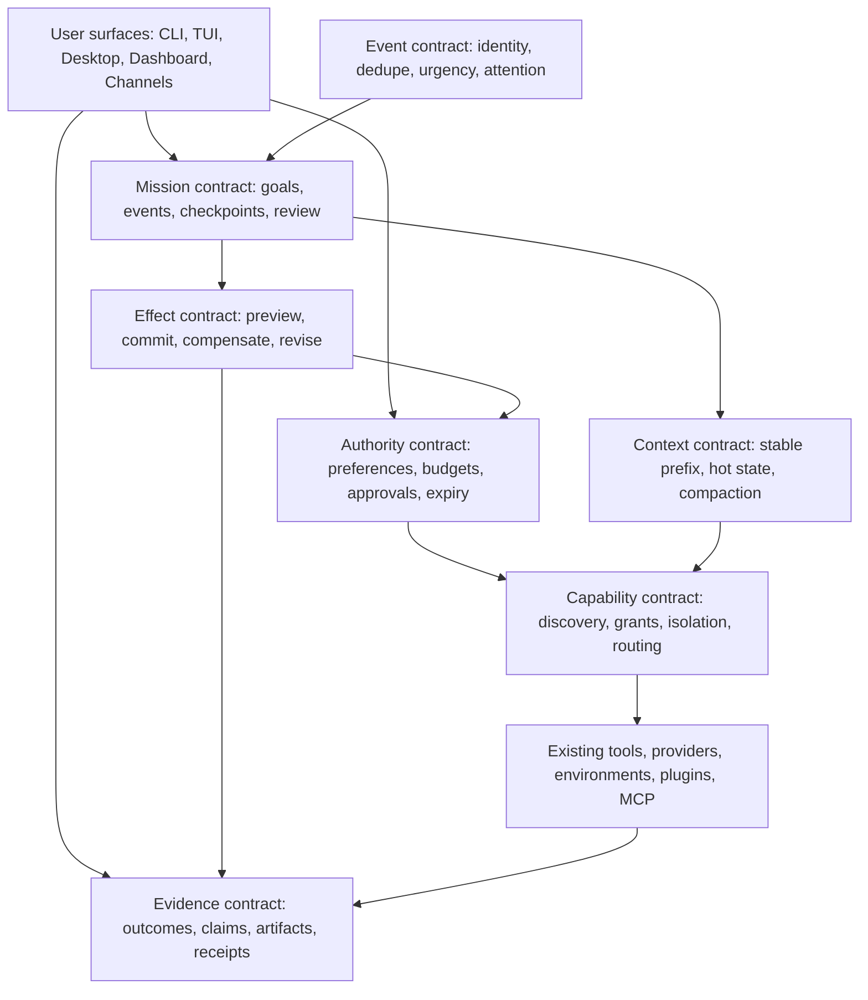

# Hermes Agent Breakthrough Opportunity Portfolio

**Date:** 2026-07-15

**Status:** Approved design; implementation not authorized by this document

**Target baseline:** `9thLevelSoftware/hermes-agent` `main` at `64a743e9decdc85daa803a9d22e1701f8a639e04`

**Repository relationship:** fork is 391 commits ahead of configured `upstream/main` and 0 behind at the audited snapshot

**Research cutoff:** 2026-07-15

**Primary value target:** individual users

## 1. Decision

Pursue a portfolio of twenty user-facing capability bets that can move Hermes from a capable reactive agent into a persistent, user-governed outcome system. The portfolio is intentionally aggressive, but every item has:

1. a concrete user outcome;
2. a credible enabling technology, standard, product API, or research result;
3. verified Hermes substrate and a specific missing contract;
4. a delivery shape compatible with Hermes's narrow-core architecture; and
5. a bounded 90-day proof that can falsify the idea before a large build.

The approved portfolio is:

1. Durable Goal-to-Outcome Missions
2. Reversible & Revisable Action Transactions
3. Teach-Once Automation Studio
4. Sovereign Personal Knowledge & Evidence Timeline
5. Universal Action Fabric
6. Preferences & Autonomy Center
7. Proactive Attention Broker
8. Plan Preview & What-If Dry Run
9. Verified Experience Compiler
10. Adaptive Intelligence Router
11. Interactive Agent Workspaces
12. Verified Outcome & Artifact Receipts
13. Sovereign Personal Compute Mesh
14. Diversity-Aware Cognitive Team Planner
15. Deterministic Information-Flow Guard
16. Live Presence
17. Safe Capability Exchange
18. Cache-Aware Context Compiler
19. Delegated Presence & Agent Federation
20. Bounded Purchase Assistant & Receipt Vault

## 2. Executive summary

Hermes is not starting from a thin chat wrapper. At the audited revision it already has a shared agent loop, dynamic tool registry, multiple execution environments, 32 model-provider plugin directories, 20 messaging-platform plugin directories, 94 top-level Python tool modules, rich browser and computer-use paths, local and external memory providers, cron/workflow/goal/Kanban systems, nested delegation, MCP and ACP interoperability, four user-interface surfaces, and more than 2,000 Python test files.

That breadth changes the correct strategy. The highest-return work is not another isolated tool or provider integration. It is connecting existing capabilities through a small set of durable contracts:

- a **mission contract** for persistent outcomes;
- an **effect contract** for preview, commit, compensation, and revision;
- an **authority contract** for preferences, budgets, approvals, and information flow;
- an **evidence contract** for claims, outcomes, artifacts, and provenance;
- a **capability contract** for safe discovery, acquisition, isolation, and routing;
- a **context contract** that preserves prompt caching while managing very long work; and
- an **event contract** that turns many channel-specific inputs into one attention-aware stream.

The strongest first product wedges are Missions, Reversible Transactions, Teach-Once Automation, the Knowledge & Evidence Timeline, and the Universal Action Fabric. They are differentiated, directly useful, and reuse unusually strong Hermes substrate. Preferences, receipts, information-flow control, and context compilation are the enabling trust and efficiency layer; they should be developed as shared contracts rather than separate model-visible tools.

The two lowest-ranked items—external agent federation and agentic commerce—are deliberate incubations. Both now have real protocols, but neither has enough demonstrated user demand or ecosystem maturity to justify a broad production build. Their 90-day work is therefore interoperability and sandbox validation, not general rollout or real-money autonomy.

## 3. Research and selection method

### 3.1 Triangulation gate

An idea made the portfolio only when all three conditions held:

| Gate | Required evidence |
|---|---|
| Transformative outcome | The result materially changes what a user can delegate, understand, control, or trust. |
| Credible frontier enabler | A primary source demonstrates a relevant mechanism, protocol, API, system, or measured result. |
| Verified Hermes gap | The current fork has useful substrate but lacks the end-to-end product or architectural contract. |

This rejects both extremes: feasible but incremental cleanup, and exciting claims without a buildable path.

### 3.2 Scoring lens

The ordering is a portfolio judgment, not a claim of mathematical precision. Each item was assessed from 1–5 on:

- **User leverage (30%)** — time saved, capability unlocked, risk reduced, and frequency of use;
- **Differentiation (20%)** — how far the result moves beyond a conventional tool-calling assistant;
- **Hermes leverage (20%)** — how much existing fork substrate it compounds;
- **Evidence readiness (15%)** — production standard/API, peer-reviewed work, or only an early preprint; and
- **Delivery feasibility (15%)** — whether a falsifiable proof and safe incremental architecture exist.

Rank also accounts for dependencies. A foundational capability can rank above a superficially flashier feature because it unlocks several downstream products.

### 3.3 Evidence maturity labels

| Label | Meaning in this report |
|---|---|
| Production / standard | Deployed system, ratified specification, or mature tool; integration risk still remains. |
| Preview / trial | Callable and testable, but API or ecosystem stability is not assured. |
| Peer-reviewed | Published research with stronger review, but not necessarily product evidence. |
| Preprint / prototype | Directionally useful evidence that must be reproduced locally before product commitment. |

No paper result is treated as a guaranteed Hermes result. Each item includes a local proof gate.

### 3.4 Explicit exclusions

The portfolio excludes:

- ordinary bug fixes, parity work, and small UX improvements, even when valuable;
- speculative hooks with no concrete consumer;
- new core tools when an existing tool, CLI + skill, service-gated tool, plugin, or MCP server is sufficient;
- vendor-specific products embedded in the core tree;
- hidden telemetry or outbound learning without explicit opt-in;
- unbounded self-modification without independent evaluation;
- claims to predict arbitrary human, market, or physical outcomes; and
- science-fiction dependencies such as neural implants or capabilities not demonstrated in software.

## 4. Current-fork capability map

### 4.1 Audited system

| Area | Current capability | Load-bearing seams |
|---|---|---|
| Agent loop | Long-running synchronous tool loop, iteration budgets, interrupts, callbacks, multiple API modes, compression, and subagents | `run_agent.py:418`, `run_agent.py:6060`, `agent/conversation_loop.py:537` |
| Tool plane | Dynamic discovery/registration, stable core toolset, operation metadata, approval hooks, programmatic code-mode access | `tools/registry.py:89`, `tools/registry.py:250-345`, `model_tools.py:1026`, `toolsets.py:31` |
| Execution | Local, Docker, SSH, Modal, Daytona, Singularity, browser, computer-use, and code-execution environments | `tools/environments/base.py:390`, `tools/code_execution_tool.py:1266`, `tools/computer_use/tool.py:238-899` |
| Providers and routing | 32 model-provider plugin directories, fallback chains, credential pools, auxiliary routing, model capabilities, and pricing | `agent/agent_init.py:1174-1196`, `agent/auxiliary_client.py:3981-4120`, `agent/models_dev.py:397-504` |
| Durable state | SQLite sessions with FTS, goals, turn outcomes, operation journal, checkpoints, delivery state, and session leases | `hermes_state.py:813`, `hermes_state.py:1023`, `agent/operation_journal.py:87-281`, `tools/checkpoint_manager.py:610-809` |
| Memory and context | Memory-provider ABC, manager, multiple external providers, provenance-bearing writes, context-engine ABC, compression | `agent/memory_provider.py:43-315`, `agent/memory_manager.py:353`, `agent/context_engine.py:32-231`, `agent/context_compressor.py:2987-3386` |
| Automation | Cron, goals, deployable workflows, persisted executions/node runs/events/schedules/feeds/dedupe, webhooks, Kanban workers, nested delegates, and MoA | `cron/scheduler.py`, `hermes_cli/goals.py:313-425`, `hermes_cli/workflows_db.py:107-209`, `hermes_cli/workflows_db.py:1289-1473`, `tools/delegate_tool.py:337-506` |
| Channels and surfaces | CLI, Ink TUI, Electron desktop, dashboard, API server, and 20 platform-plugin directories | `cli.py`, `tui_gateway/server.py`, `apps/desktop/`, `web/`, `gateway/platforms/api_server.py:1860-2171` |
| Interoperability | MCP client/catalog/serve, ACP adapter, remote gateway proxy, plugin discovery and provider ABCs | `tools/mcp_tool.py:1672-1769`, `hermes_cli/mcp_catalog.py:390-791`, `acp_adapter/server.py:865-1296`, `mcp_serve.py:543-977` |
| Learning and verification | Turn-outcome ledger, reflection triggers, trajectory capture, background review, curator backup/rollback, verification hooks | `agent/turn_ledger.py:28-118`, `agent/trajectory.py:30-56`, `agent/background_review.py:599-626`, `agent/curator_backup.py:539-681` |
| Security | Approval engine, secret scopes, redaction, memory-injection checks, skill quarantine/scanning/attestation, pinned MCP catalog | `tools/approval.py:2363-3014`, `agent/secret_scope.py:9-151`, `agent/redact.py:491-736`, `tools/skills_guard.py:632-766` |

### 4.2 Status of the earlier harness roadmap

The user's belief that the first three prior proposals were implemented is close but needs one correction: the first two are complete, while the third is an important partial implementation.

| Earlier proposal | Audited status | Evidence | Treatment in this portfolio |
|---|---|---|---|
| 1. Code-Mode Tool Orchestration | Implemented | merged by `ea068b89a`; persistent kernels, programmatic full-registry access, and artifacts exist in `tools/code_execution_tool.py` | Baseline substrate, not a new slot |
| 2. Turn-Outcome Ledger | Implemented | merged by `575b6b629`; schema starts at `hermes_state.py:813`, with turn ledger and reflection integration | Baseline for #9 and #12 |
| 3. Durable Agent Execution | Partially implemented | merged by `dea930324`; operation journaling and unknown-effect recovery exist, but full-turn/fleet resume and general exactly-once effects do not | Expanded into #1 and #2 |
| 4. Declarative Permission Policy | Planned over partial approval substrate | approvals and operation metadata exist; no unified declarative preference/authority/flow system | Consolidated into #6 and #15 |
| 5. Event-Driven Automations | Planned over substantial automation substrate | gateway events, cron, webhook, goals, and workflows exist; no canonical event/attention contract | Consolidated into #1 and #7 |
| 6. Tiered Paged Memory | Partial substrate | provider ABC, manager, plugins, FTS, and provenance exist; no temporal evidence graph or complete data lifecycle | Expanded into #4 |
| 7. Provider-Native Context | Partial | `ContextEngine` and compression exist, with some provider-specific paths; no cache-aware segment compiler | Expanded into #18 |
| 8. MCP Capability Acquisition | Substantial partial substrate | discovery, OAuth, catalog pins, scanning, and MCP serving exist; lifecycle is not unified with skills/plugins or sandbox grants | Expanded into #17 |
| 9. OS Sandbox + Credential Broker | Partial point defenses | isolated environments, secret scopes, redaction, and approvals exist; no deterministic label propagation or universal broker | Consolidated into #15 and #17 |
| 10. Sleep-Time Consolidation | Partial learning substrate | background review and curator paths exist; no independent held-out evaluation and promotion pipeline | Consolidated into #9 |
| 11. Cost/Wall-Clock Budgets | Partial | iteration budgets, goal budgets, pricing, and model metadata exist; no cross-resource user authority contract | Consolidated into #6 and #10 |
| 12. Verified Skill Edits | Partial | write approval, provenance, backup, and verification hooks exist; no independent behavioral verifier/promotion gate | Consolidated into #3 and #9 |
| 13. Batch Trajectory Distillation | Partial | trajectories and outcome attribution exist; no experience compiler with held-out acceptance | Consolidated into #9 |

The remaining roadmap therefore consumes five broad architectural areas rather than ten separate portfolio positions: missions, authority/security, personal knowledge, verified learning, and capability/context infrastructure.

## 5. Architectural direction

The portfolio should not become twenty unrelated subsystems. Seven shared contracts provide the narrow waist:

### 5.1 Invariants

Every proposal must preserve the repository's load-bearing design rules:

1. The system prompt and cached prefix remain byte-stable for a conversation; normal feature state never rewrites past context.
2. Message-role alternation remains valid; no synthetic user message is inserted mid-loop.
3. Most capability ships at the edge. New model-visible core tools are a last resort.
4. Non-secret configuration lives in `config.yaml`; credentials alone use secret stores or `.env`.
5. Every state, security, resolution, and remote-I/O change receives real-path E2E coverage against a temporary `HERMES_HOME`.
6. Point-in-time results are never mislabeled as exactly-once, reversible, private, or verified when an external dependency cannot provide that guarantee.
7. Learned behavior never grades and promotes itself without an independent signal.
8. Proactivity, telemetry, sensing, federation, and commerce remain explicit opt-ins.
9. Profiles remain independent islands; this portfolio does not introduce live default-profile inheritance.

## 6. Portfolio scorecard

Ratings are directional (`1` weak/early, `5` exceptional/ready). Rank includes user value, dependency leverage, and portfolio balance, so close numeric ratings should not be read as precise forecasts.

| # | Capability | User | Novelty | Evidence | Hermes fit | Feasibility | Recommended posture |
|---:|---|:---:|:---:|:---:|:---:|:---:|---|
| 1 | Durable Goal-to-Outcome Missions | 5 | 4 | 4 | 5 | 4 | Build first |
| 2 | Reversible & Revisable Action Transactions | 5 | 5 | 3 | 5 | 3 | Build bounded core contract |
| 3 | Teach-Once Automation Studio | 5 | 5 | 3 | 5 | 4 | Build first product proof |
| 4 | Sovereign Personal Knowledge & Evidence Timeline | 5 | 4 | 3 | 5 | 3 | Build staged provider proof |
| 5 | Universal Action Fabric | 5 | 5 | 3 | 5 | 4 | Build WebMCP-first proof |
| 6 | Preferences & Autonomy Center | 5 | 4 | 3 | 5 | 4 | Build shared contract |
| 7 | Proactive Attention Broker | 5 | 4 | 3 | 5 | 4 | Shadow-mode proof first |
| 8 | Plan Preview & What-If Dry Run | 4 | 5 | 3 | 4 | 3 | Bound to declared effects |
| 9 | Verified Experience Compiler | 5 | 5 | 3 | 5 | 3 | Prove on one domain |
| 10 | Adaptive Intelligence Router | 5 | 4 | 4 | 5 | 4 | Shadow/replay then enable |
| 11 | Interactive Agent Workspaces | 4 | 5 | 3 | 4 | 4 | Bounded UI grammar proof |
| 12 | Verified Outcome & Artifact Receipts | 5 | 4 | 5 | 5 | 4 | Build shared evidence layer |
| 13 | Sovereign Personal Compute Mesh | 4 | 5 | 2 | 4 | 2 | Focused two-device proof |
| 14 | Diversity-Aware Cognitive Team Planner | 4 | 4 | 3 | 5 | 4 | Benchmark before defaulting |
| 15 | Deterministic Information-Flow Guard | 5 | 5 | 3 | 4 | 2 | Security R&D track |
| 16 | Live Presence | 4 | 5 | 3 | 4 | 3 | Opt-in usability proof |
| 17 | Safe Capability Exchange | 4 | 4 | 3 | 5 | 3 | Unify lifecycle incrementally |
| 18 | Cache-Aware Context Compiler | 5 | 4 | 4 | 5 | 4 | Build with invariant tests |
| 19 | Delegated Presence & Agent Federation | 3 | 5 | 3 | 4 | 3 | Incubate behind plugin |
| 20 | Bounded Purchase Assistant & Receipt Vault | 4 | 5 | 2 | 4 | 2 | Sandbox only until dependencies mature |

## 7. Detailed portfolio

Each section distinguishes current Hermes substrate from the missing product. The proof gates are intentionally measurable and are not implementation estimates.

### 7.1 Durable Goal-to-Outcome Missions

**Layman outcome:** A user gives Hermes a long-running outcome, leaves, and can trust it to continue across crashes, restarts, channels, timers, and approval waits without losing progress or repeating completed work.

**Why now.** Durable workflow infrastructure is no longer speculative. Microsoft's [durable-agent extension](https://learn.microsoft.com/en-us/agent-framework/integrations/durable-extension) checkpoints sessions and supports suspension for timers or human input, while [MCP Tasks](https://modelcontextprotocol.io/specification/2025-11-25/basic/utilities/tasks) defines pollable and cancellable asynchronous task states. The July 2026 [StructAgent](https://arxiv.org/abs/2607.11388) preprint also reports large gains from compact typed state and verifier-backed progress, though those benchmark results require independent reproduction.

**Hermes position.** Hermes already has durable goal contracts and post-turn judging (`hermes_cli/goals.py:313-425`, `hermes_cli/goals.py:1113-1441`) plus a substantial workflow aggregate that persists definitions, executions, node runs, events, schedules, feeds, and dedupe state (`hermes_cli/workflows_db.py:107-209`) and exposes execution detail/timelines (`hermes_cli/workflows_db.py:1289-1473`). Cron, Kanban workers, and the operation journal add more substrate. The missing unit is a mission-level contract that connects a user outcome and authority snapshot to one or more existing workflow executions, external waits, review items, artifacts, receipts, recovery decisions, and a verified terminal condition. Workflow capabilities advertise webhook and Kanban triggers, but the implementation is not yet a complete shared event-to-mission lifecycle.

**Design.** Extend goals and workflows around a versioned `MissionRecord`, not a new core model tool. The mission owns the immutable user objective/constraints, authority/evidence requirements, cross-execution correlation, pending-human review queue, and terminal verdict; it links to existing `WorkflowExecution` records rather than re-owning their task graph, node attempts, event cursor, or recovery timeline. On restart, reconciliation must distinguish safe retry, confirmed completion, and unknown external effect; unknown is surfaced rather than guessed. Mission updates enter conversation state through normal tool results or turn input, never by mutating the cached system prompt.

**90-day proof.** Run 30 multi-hour missions spanning file work, browser research, messaging, a timer, and a human approval. Inject process kills at each lifecycle boundary, resume from a second channel, expire credentials, and replay duplicate events. Pass only if at least 90% reach the correct terminal state, instrumented externally visible effects are never duplicated, all unknown effects are surfaced, and every completion has an end-state receipt.

**Dependencies and failure conditions.** Production autonomy depends on #2 transactions, #6 authority, and #12 receipts. Checkpointing alone is not success: if tools lack idempotency or reconciliation, the system must not advertise exactly-once behavior.

**Delivery:** Footprint Ladder rung 1—extend goals/workflows and expose CLI/Desktop/Dashboard surfaces at the edge.

### 7.2 Reversible & Revisable Action Transactions

**Layman outcome:** Hermes can show what an action will do, commit it under current permission, revise the remaining plan, and undo or compensate completed steps when the underlying service makes that possible.

**Why now.** Recent systems have begun treating an agent run as an effect transaction rather than an unstructured sequence. [Cordon](https://arxiv.org/abs/2606.17573) uses shadow state and an external-effect outbox; [Revisable by Design](https://arxiv.org/abs/2604.23283) studies dependency-aware rollback; and [commit-time authorization](https://arxiv.org/abs/2607.10487) addresses the gap between permission granted during planning and effects committed later. These are early preprints, while established saga/compensation patterns provide the mature distributed-systems base.

**Hermes position.** Hermes has a durable operation journal with payload/idempotency hashes and unknown-effect recovery (`agent/operation_journal.py:87-281`), operation metadata in the registry (`tools/registry.py:109-143`, `tools/registry.py:319-345`), delivery receipts, approvals, and filesystem checkpoints (`tools/checkpoint_manager.py:610-809`). It lacks a general `prepare → preview → commit → compensate` contract, dependency-aware revision, per-effect compensation handlers, and a truthful undo-eligibility model.

**Design.** Add optional transaction semantics to the existing registry and journal. An effect adapter declares whether an operation is read-only, reversible, compensatable, idempotent, externally reconcilable, or irreversible; it can implement preview, commit, reconcile, and compensate. A transaction graph stages outward effects, rechecks the current authority contract immediately before commit, persists receipts before reporting success, and rolls back only along valid dependency edges. Irreversible effects remain explicit boundaries requiring stronger approval—they are never marketed as undoable.

**90-day proof.** Instrument three representative effect families: filesystem changes, outbound messages, and one browser/service action. Inject 100 plan revisions, stale approvals, crashes, duplicate deliveries, and partial failures. Require zero unauthorized irreversible commits, no duplicate instrumented effects, correct compensation ordering, explicit classification of every non-reversible operation, and less than 15% median overhead on eligible flows.

**Dependencies and failure conditions.** #6 defines authority and #12 records proof. A provider without idempotency, queryable state, or compensation can be guarded and reconciled but cannot be made magically transactional.

**Delivery:** Footprint Ladder rung 1 for generic metadata/journaling; compensation adapters remain tool/plugin-owned.

### 7.3 Teach-Once Automation Studio

**Layman outcome:** A user demonstrates a workflow once and Hermes turns it into a parameterized, testable automation that can handle changed inputs and common interruptions.

**Why now.** Microsoft's [Instruction Agent](https://arxiv.org/abs/2509.07098) extracts instructions from a single demonstration and uses verifier/backtracker modules; it reports 60% success on 20 selected OSWorld tasks that comparison agents failed. That is promising but small evidence. A June 2026 [trajectory-to-`SKILL.md` diagnostic](https://arxiv.org/abs/2606.20363) provides the necessary warning: readable mined skills did not reliably transfer, so demonstration compilation must include varied replay and behavioral evaluation.

**Hermes position.** Computer use already records/replays actions and media (`tools/computer_use/cua_backend.py:1940-1971`), the agent saves trajectories (`agent/trajectory.py:30-56`), workflows have validated typed specifications (`hermes_cli/workflows_spec.py:190-497`), cron has parameterized blueprints (`cron/blueprint_catalog.py:661-710`), and skill writes can be staged (`tools/skill_manager_tool.py:1259-1345`). There is no coherent user-facing path from demonstration through segmentation, secret/input abstraction, sandbox replay, evaluation, versioning, and promotion.

**Design.** A Desktop-first recorder captures actions, observations, user corrections, and success evidence while redacting secrets. A compiler segments the trace into semantic steps, asks the user to label variable inputs and invariants, and produces a declarative action graph plus a human-readable skill/runbook. Verifier and backtracker paths replay it against altered fixtures and expected interruptions. The user reviews the inferred parameters, required permissions, unsafe boundaries, and test results before promotion. Published automations are versioned and can be rolled back. A promoted skill or command becomes globally discoverable only in a new conversation; the current conversation may invoke it only through the existing user-message skill-command path, never by rebuilding its cached prefix or tool schema.

**90-day proof.** Record 20 demonstrations across five workflows involving web, desktop, and file tasks. Test each against changed values, reordered lists, one popup/interruption, and one negative fixture. Pass if at least 70% complete successfully without manual repair, no dangerous step executes silently, all secrets are parameterized or brokered rather than embedded, and failures stop with an actionable diagnosis.

**Dependencies and failure conditions.** #5 improves action reliability, #8 supplies safe replay, #9 supplies later experience-based refinement, and #12 supplies success evidence. A trace that succeeds only on the recorded screen coordinates is not a learned automation.

**Delivery:** Footprint Ladder rung 2—CLI + skill and Desktop authoring surface, reusing existing computer-use/workflow machinery.

### 7.4 Sovereign Personal Knowledge & Evidence Timeline

**Layman outcome:** Hermes maintains a user-controlled history of people, projects, preferences, facts, sources, changes, and contradictions that the user can inspect, correct, export, or erase.

**Why now.** [Graphiti/Zep](https://arxiv.org/abs/2501.13956) and [A-MEM](https://arxiv.org/abs/2502.12110) show temporal and dynamically linked approaches to agent memory, while 2026 work on [user-governed cross-platform personalization](https://arxiv.org/abs/2605.09794) argues that only the user can combine fragmented personal context across services. The strongest governance result is the [deployment-time memory deletion](https://arxiv.org/abs/2606.10062) study: deleting raw records alone left substantial derived residue, while lineage-aware purge/tombstone methods removed the tested canaries. All remain early evidence, so the product must treat extracted claims as revisable, not truth.

**Hermes position.** Hermes has memory-provider and manager abstractions (`agent/memory_provider.py:43-315`, `agent/memory_manager.py:903-1034`), committed-memory gating and provenance metadata, FTS session/tool histories (`hermes_state.py:4338-4519`), turn outcomes (`agent/turn_ledger.py:28-118`), and web results with URL/title metadata. It lacks a temporal entity/fact/claim graph, claim-to-source evidence edges, validity intervals, confidence/freshness, contradiction workflows, multimodal indexing, and a complete inspect/edit/delete interface.

**Design.** Store immutable evidence records separately from derived claims. Claims carry source edges, extraction method, time interval, confidence, visibility/consent scope, and supersession or contradiction links. Derived summaries, embeddings, graph edges, exports, and caches record their lineage so correction or deletion can cascade. User edits remain explicit higher-authority assertions rather than silently rewriting source history. A timeline UI shows why Hermes believes something, what disagrees, when it was last checked, and every downstream copy affected by deletion.

**90-day proof.** Ingest two authorized cross-platform exports plus Hermes session memory, seed temporal changes, contradictions, and deletion canaries, then expose a timeline/editor. Freeze at least 100 ground-truthed temporal questions/claims with validity intervals and expected evidence before evaluation. Pass with at least a 10-percentage-point improvement in evidence-backed answer accuracy over current retrieval, at least 90% evidence precision and 80% evidence recall, no increase in stale-conflict answers, explicit origin for every displayed claim, and zero recovered canaries after erasure across raw memory, summaries, embeddings, graph indexes, caches, and exports controlled by Hermes.

**Dependencies and failure conditions.** The graph engine should be a memory-provider plugin with only generic ABC widening in core. The system must distinguish “source says,” “Hermes inferred,” and “user confirmed”; provenance does not make an extracted claim correct.

**Delivery:** Footprint Ladder rung 4 plus minimal rung-1 provider-contract extensions and edge UI.

### 7.5 Universal Action Fabric

**Layman outcome:** Hermes automatically uses the most reliable available way to act—official structured command, API/MCP, page structure, vision, or native mouse and keyboard—without losing context or safety rules when it changes methods.

**Why now.** The W3C community [WebMCP explainer](https://github.com/webmachinelearning/webmcp) and the [Chrome 149 origin trial](https://developer.chrome.com/blog/ai-webmcp-origin-trial) let a website expose typed actions that reuse current page state and authentication. Chrome's [security guidance](https://developer.chrome.com/docs/ai/webmcp/secure-tools) also makes clear that site-provided tools are an untrusted surface. Platform-specific structured actions such as Apple App Intents show the same direction in production ecosystems, but no universal schema or adoption level yet exists.

**Hermes position.** Hermes already discovers MCP capabilities (`tools/mcp_tool.py:1672-1769`), dynamically searches tools (`tools/tool_search.py:620-708`), drives multiple local/cloud/browser backends (`tools/browser_tool.py:897-1155`, `tools/browser_tool.py:2062-2560`), and falls back to visually grounded computer use (`tools/computer_use/tool.py:238-899`). The gap is a common resolver and state handoff across structured API/MCP/WebMCP, DOM/accessibility, vision, and native UI while retaining the same authority, transaction, and receipt context.

**Design.** Introduce an internal `ActionIntent` and adapter capability contract over existing tools. The resolver ranks eligible paths by structure, origin trust, state fidelity, historical reliability, latency, cost, and risk; preferred order is structured site/app capability, DOM/accessibility, visual browser, then native UI. Escalation preserves task variables, authenticated user state, evidence, and effect identifiers. A fallback may not silently gain broader permission, and destructive actions must still cross the same commit boundary.

**90-day proof.** Instrument three representative sites with WebMCP and execute the same task families through structured and existing browser paths, including stale schemas and forced fallback. Pass if completion improves materially, wrong-target actions decline, state transfers correctly between paths, hostile tool descriptions cannot widen authority, and every committed effect retains one receipt lineage.

**Dependencies and failure conditions.** #6 authority, #12 receipts, and #15 information-flow control travel with an action across adapters. WebMCP availability is an optimization, not a hard dependency or the product name.

**Delivery:** Footprint Ladder rung 1—an orchestrator above existing tools; site/app adapters remain plugins or MCP servers.

### 7.6 Preferences & Autonomy Center

**Layman outcome:** A user gets one understandable place to control what Hermes may do, spend, share, remember, interrupt about, or require approval for.

**Why now.** DeepMind's work on [editable intent-belief graphs](https://deepmind.google/research/publications/121578/) reports helpful editable intent and targeted clarification in a text-to-image setting. Its later work on [user-adaptive reward features](https://deepmind.google/research/publications/141313/) studies compact adaptable reward models. [Magentic-UI](https://www.microsoft.com/en-us/research/wp-content/uploads/2025/07/magentic-ui-report.pdf) provides a practical precedent for editable co-planning and explicit accept/interrupt controls. None validates deterministic authorization UX for spending, deletion, or data sharing; transferring these interaction patterns to an autonomy center is a product hypothesis that the 90-day proof must test.

**Hermes position.** Hermes already has clarification (`tools/clarify_tool.py:56-125`), goal contracts, independent profiles, approval modes, and generic tool approval (`tools/approval.py:2363-3014`). It lacks a versioned preference/authority object with provenance, confidence, expiry, contextual exceptions, recipients/data scopes, autonomy bands, budgets, and a complete decision audit. Live inheritance from a default profile is intentionally excluded because profiles are independent islands (`hermes_cli/profiles.py:2-18`).

**Design.** The center edits an `AutonomyContract` whose rules are explicit user assertions, learned suggestions awaiting confirmation, or temporary task mandates. Stable user preferences live in `config.yaml`; learned suggestions, task-scoped mandates, expiry/consumption state, and the decision audit live in durable SessionDB/runtime state so transient authority cannot silently become global. Rules evaluate action class, data classification, destination, cost, time, uncertainty, reversibility, and expiry into allow/ask/deny plus required evidence. Conflicts resolve conservatively and visibly. The model can recommend a rule or ask a high-value clarification, but a deterministic evaluator makes the final policy decision and records why.

**90-day proof.** Exercise 50 pre-registered ambiguous and conflicting tasks covering recipients, sharing, deletion, purchases, outbound messages, model/privacy routing, and expired approval. Compare against current approval behavior. Pass with zero contract violations, at least 20% fewer clarification/approval prompts on cases whose correct authority is already explicit, correct conservative conflict handling, and user ability to explain or change every effective rule from the UI.

**Dependencies and failure conditions.** #15 enforces data-flow rules and #2 revalidates immediately before commit. Inferred preference is never equivalent to authorization.

**Delivery:** Footprint Ladder rung 1/2—config for stable preferences, durable runtime state for scoped authority/audit, plus CLI/Desktop/Dashboard controls; no new core tool schema.

### 7.7 Proactive Attention Broker

**Layman outcome:** Hermes watches only authorized event sources, acts when safely useful, batches routine noise, and interrupts the user only when the expected benefit justifies the interruption.

**Why now.** Microsoft's 2026 [temporal-graph triggering](https://arxiv.org/abs/2605.30152) work reports that a small local model can decide when to wake and what event to anchor more efficiently than using a large model for every event. ACL 2026 [ProActor](https://aclanthology.org/2026.acl-long.832/) evaluates opportunity windows rather than demanding one exact trigger time. These are useful mechanisms, but offline timing labels do not establish that a real user will welcome an interruption.

**Hermes position.** Gateway adapters already ingest events, debounce bursts, merge pending messages, process reactions, and deduplicate webhooks (`gateway/platforms/base.py:1725-1755`, `gateway/platforms/base.py:2095-2305`, `gateway/platforms/webhook.py:464-739`). Cron, goals, workflows, and reflection triggers can act later. Missing are a canonical cross-source envelope, identity/deduplication across channels, urgency/relevance estimation, attention budgets, digesting, a shadow-mode inbox, and action policy. Webhook workflow triggers are declared but not fully implemented (`hermes_cli/workflows_capabilities.py:11-24`).

**Design.** Normalize authorized inputs into an `EventEnvelope` with source identity, subject/entity links, time semantics, dedupe key, sensitivity label, and causal predecessor. Cheap deterministic/local filters discard or group routine events; an optional small model ranks uncertain cases; an expensive model is invoked only after the wake decision. The broker chooses ignore, update a mission, perform a pre-authorized reversible action, place in review, include in digest, or interrupt now. Each user has explicit interruption and action budgets.

**90-day proof.** Run two real event sources in no-action shadow mode for at least ten active eight-hour days, covering at least 500 normalized events and 100 surfaced candidates. Label surfaced events `useful`, `premature`, or `not useful`, and audit at least 100 stratified suppressed events for misses. Require usefulness precision `useful / (useful + premature + not useful) ≥ 85%`, fewer than one premature interruption per active eight-hour day, no more than 5% high-value misses in the audited suppressed sample, reliable dedupe, no action outside the authority contract, and a complete review trail before enabling only reversible pre-authorized actions.

**Dependencies and failure conditions.** #1 receives mission events and #6 owns authority/attention budgets. A high recall system that annoys the user is a failure.

**Delivery:** Footprint Ladder rung 1 for a shared gateway broker; source connectors stay plugins or service-gated.

### 7.8 Plan Preview & What-If Dry Run

**Layman outcome:** Before touching reality, Hermes can compare several approaches inside a bounded simulation and show likely changes, irreversible boundaries, and missing assumptions.

**Why now.** Shadow execution in [Cordon](https://arxiv.org/abs/2606.17573) and dependency-aware revision in [Revisable by Design](https://arxiv.org/abs/2604.23283) make a bounded preview technically credible. The [Computer-Using World Model](https://arxiv.org/abs/2602.17365) shows one-step action search over predicted Microsoft Office interface states; it does not demonstrate generic multi-step simulation across browsers, filesystems, services, and workflows. Extending counterfactual search across Hermes's declared effect adapters is therefore a testable hypothesis, not an established result. Nothing here justifies a general “digital twin” of people or the world.

**Hermes position.** Hermes has isolated environments and network controls (`tools/environments/base.py:390-1048`, `tools/environments/docker.py:568-929`), deterministic reliability fakes, workflow validation/result contracts, and checkpoint diff/restore (`tools/checkpoint_manager.py:759-809`). It lacks a general effect-model interface, simulated external state, counterfactual scorer, and predicted-versus-observed comparison.

**Design.** #2 owns the effect-level preview, revision, and compensation protocol for one chosen action graph. #8 adds the distinct counterfactual layer: generate materially different candidate plans, execute each through those same bounded adapters/sandboxes, score them against user-specified criteria, and compare predicted end states and uncertainty before selecting one. The result shows predicted changes, evidence, cost/time estimates, modeled and unmodeled effects, confidence, and the first irreversible boundary. External-state simulators are provider plugins; unsupported effects are marked unknown rather than hallucinated.

**90-day proof.** Evaluate 30 tasks across filesystem refactors, workflow changes, and instrumented browser/service actions. Before running, enumerate all observable effect fields and severity classes in fixture manifests. Require at least 90% precision and recall over declared effects, no missed critical/irreversible effect, severity-weighted false-negative loss below a preset bound, and significantly better selected-plan success than a no-simulator baseline under the same time/cost budget. Declaring fewer fields cannot improve the score.

**Dependencies and failure conditions.** #2 supplies semantics and #12 compares prediction with observed end state. Predicting human responses, market prices, or arbitrary websites without an explicit model is out of scope.

**Delivery:** Footprint Ladder rung 2—CLI + skill on transaction adapters; provider simulations stay plugins.

### 7.9 Verified Experience Compiler

**Layman outcome:** Hermes learns from successful and failed work, but keeps an improvement only after it demonstrably beats the current behavior on separate tests.

**Why now.** [AgentRunbook-C](https://arxiv.org/abs/2605.12493) reports that file-based environment experience substantially outperformed a retrieval baseline in its benchmark. [GEPA](https://arxiv.org/abs/2507.19457), an ICLR 2026 Oral, evolves prompts through reflective trajectory search with much lower rollout demand than common reinforcement approaches. The trajectory-to-skill diagnostic and the 2026 [Agentic Evolution](https://www.microsoft.com/en-us/research/wp-content/uploads/2026/07/agentic-evolution.pdf) survey supply the safety boundary: readable artifacts and self-referential grading do not prove transfer; reliable autonomous evolution is strongest where independent deterministic verifiers exist.

**Hermes position.** Turn outcomes and skill attribution exist (`agent/turn_ledger.py:28-118`, `agent/turn_ledger.py:302-336`), as do trajectory capture, reflection, background review (`agent/background_review.py:599-626`), curator backup/rollback (`agent/curator_backup.py:539-681`), write provenance, and verification hooks. Missing is an end-to-end compiler that groups comparable experiences, synthesizes candidate runbook/skill diffs, evaluates them on held-out cases, audits acceptance, and promotes atomically.

**Design.** A background compiler selects a narrow behavior and builds a redacted dataset of successful, failed, and corrected trajectories. It proposes a discrete artifact change—never an opaque unrestricted self-rewrite—then evaluates current versus candidate in isolated environments using deterministic end-state checks where possible and a separate judge only where necessary. Promotion requires a configured improvement threshold, no safety regression, human approval for behavioral changes, immutable provenance, and one-command rollback. Promoted skills/runbooks become active for new conversations or through the existing user-message skill-command path; they never trigger a mid-conversation cached-prefix or tool-schema rebuild.

**90-day proof.** Use 100 trajectories from one integration to produce candidate runbook/skill changes and evaluate on unseen fixtures. Pass only if the candidate improves task success by a meaningful preset margin (target 10 percentage points), produces no regression on safety/invariant cases, never grades its own outputs with the acting agent, and can be rolled back with its complete evidence record.

**Dependencies and failure conditions.** #12 provides outcome evidence and #17 secures the promoted artifact. Cross-domain generalization is not assumed; a win on one integration authorizes only that domain.

**Delivery:** Footprint Ladder rung 1/2—background compiler and existing skill lifecycle, with pluggable evaluation backends.

### 7.10 Adaptive Intelligence Router

**Layman outcome:** Hermes chooses the cheapest, fastest, most private model that is likely to succeed at each step and escalates when the partial result shows it should.

**Why now.** [SWE-Router](https://arxiv.org/abs/2607.00053) uses partial trajectories to improve escalation decisions; [R2-Router](https://arxiv.org/abs/2602.02823) jointly chooses model and output budget; and ACL 2026 [EvoRoute](https://aclanthology.org/2026.acl-long.1771/) studies Pareto-efficient per-step routing. Reported cost reductions are benchmark- and model-dependent, so Hermes must calibrate against its own workload rather than copy a published threshold.

**Hermes position.** Hermes already supports primary/fallback models, credential pools, auxiliary model chains, provider selection, capabilities, and pricing (`agent/agent_init.py:1174-1196`, `agent/auxiliary_client.py:3981-4120`, `agent/models_dev.py:397-504`). Current routing is configured or reactive, not a calibrated per-step policy over task type, partial trajectory, quality, latency, cost, privacy/residency, risk, remaining budget, and uncertainty.

**Design.** A `RouterDecision` evaluates hard constraints first—data locality, modality, tool capability, authority, and budget—then predicts expected utility across eligible model/effort choices. The primary conversation provider/model remains pinned for that conversation so its cache identity is stable. Adaptive choices apply to auxiliary calls, subagents, evaluators, and newly created task executions; changing the primary provider/model is an explicit conversation transition with a new cache lineage, not an invisible per-step swap. The router can inspect partial progress and verifier signals before assigning or escalating auxiliary work without discarding safe artifacts. Decisions, alternatives, confidence, cache identity, and realized outcome are logged for calibration. Users retain hard provider/model overrides and a “never send this class of data remotely” rule.

**90-day proof.** Freeze and stratify 500 representative tasks, their end-state scorers, and safety slices before routing evaluation. “Quality within two points” means no more than two absolute percentage points below strongest-model-only verified success over the full frozen corpus, with no regression allowed on irreversible/high-risk slices. Require at least 30% lower model cost and lower or equal cost per verified success, no privacy/residency violation, stable primary-conversation provider/model cache identity, and calibrated escalation that outperforms static cheap-first and frontier-only auxiliary baselines.

**Dependencies and failure conditions.** #6 supplies hard user policy and #12 supplies outcome labels. Cost savings that conceal quality loss are a failure.

**Delivery:** Footprint Ladder rung 1—extend existing model/provider routing and observability; providers remain plugins.

### 7.11 Interactive Agent Workspaces

**Layman outcome:** Hermes can create the right safe visual workspace for a task—plans, forms, comparisons, timelines, inspectors, or approval panels—instead of forcing everything through prose chat.

**Why now.** A2UI 0.9 provides an open declarative model for [agent-generated interfaces](https://developers.googleblog.com/en/a2ui-v0-9-generative-ui/), while [MCP Apps](https://modelcontextprotocol.io/extensions/apps/overview) and [AG-UI](https://docs.ag-ui.com/concepts/architecture) establish interoperable patterns for interactive agent surfaces. Research prototypes such as [Generative Interfaces](https://arxiv.org/abs/2508.19227), [DuetUI](https://arxiv.org/abs/2509.13444), and [Macaron-A2UI](https://arxiv.org/abs/2605.24830) report promising usability results, but the studies are small and do not justify arbitrary generated application code.

**Hermes position.** Desktop already renders structured tool cards and artifacts (`apps/desktop/src/components/assistant-ui/thread/message-parts.tsx:20-30`, `apps/desktop/src/components/assistant-ui/tool/fallback.tsx:309-728`), the dashboard has plugin slots (`web/src/plugins/slots.ts:58-132`), and MCP results can carry structured blocks (`tools/mcp_tool.py:4110-4173`). Missing are a trusted declarative workspace protocol, bounded component registry, origin/sandbox rules, bidirectional action/approval events, persisted interactive state, and a consistent textual fallback.

**Design.** Define a versioned `WorkspaceEnvelope` containing only audited components—forms, tables, comparisons, timelines, progress, evidence, artifacts, and approval controls—with stable action IDs bound to backend commands. Models select and populate components but cannot ship executable JavaScript. Desktop and dashboard render the same semantic envelope with surface-specific presentation; TUI/CLI receive an equivalent accessible text representation. All actions cross normal authority and transaction checks.

**90-day proof.** Implement five component families and pre-register 20 paired tasks involving plan review, multi-option comparison, mission monitoring, evidence inspection, and approval. Compare against chat-only using median time-to-correct-completion, incorrect committed actions, comprehension questions, and accessibility checks. Pass with at least 20% lower median completion time or 25% fewer errors without worsening the other metric, no comprehension regression, every action keyboard/screen-reader reachable, correct state resume, and no arbitrary-code or privilege-bypass path.

**Dependencies and failure conditions.** #1, #6, and #12 supply the most valuable workspaces. Visual novelty without lower cognitive load is not success.

**Delivery:** Footprint Ladder rung 1 at the UI edge for the shared first-party envelope, safe renderer bindings, and text fallback; rung 4/5 for optional component producers and MCP Apps; no new core model tool.

### 7.12 Verified Outcome & Artifact Receipts

**Layman outcome:** Hermes shows evidence of what changed, whether the requested end state really holds, what was produced, and what remains uncertain instead of merely saying “done.”

**Why now.** The UK AI Security Institute's [Inspect](https://inspect.aisi.org.uk/) framework supports sandboxed agents, end-state scorers, and trajectory scanning. [C2PA 2.4](https://spec.c2pa.org/specifications/specifications/2.4/specs/C2PA_Specification.html), published in April 2026, expands signed provenance and supports structured text such as source code, YAML, and Markdown. Inspect makes verification practical; C2PA can prove origin/process metadata, not factual truth.

**Hermes position.** Hermes already records turn outcomes and verification evidence (`agent/turn_ledger.py:28-118`, `agent/verification_stop.py:191-308`), operation and delivery receipts, checkpoints, and persisted code artifacts (`tools/code_execution_tool.py:699-903`). The evidence is fragmented. There is no canonical lineage from user intent through plan/version, operation/effect, observed state, verifier, artifact hash, signer, freshness, and recheck status.

**Design.** Create a shared receipt schema in the state/artifact layer. A receipt contains the immutable requested outcome and constraints, mission/step and transaction IDs, before/after observations, effect claims, independent verifier results, evidence pointers, artifacts and hashes, uncertainty, freshness, and signatures where configured. Receipts support `verified`, `completed_unverified`, `failed`, `blocked`, and `unknown_effect`; only an appropriate end-state scorer can emit `verified`. Rechecking creates a new linked observation rather than rewriting history.

**90-day proof.** Seed false-success conditions in 50 missions—silent no-op, wrong file, stale page, partial delivery, reverted change, forged-looking artifact, and grader ambiguity. Require zero seeded failures labeled verified, at least 90% correct terminal classification, traceability from every claimed effect to evidence, and a user-readable receipt that can be independently rechecked.

**Dependencies and failure conditions.** This is a shared prerequisite for #1, #2, #9, #14, #19, and #20. A signature proves who produced an artifact, not that its claims are true.

**Delivery:** Footprint Ladder rung 1—canonical SessionDB/artifact schema and edge viewers; optional signing is service-gated/plugin-backed.

### 7.13 Sovereign Personal Compute Mesh

**Layman outcome:** Hermes can securely move a task among the user's own devices and an optional attested remote machine so work runs where the required data, credentials, hardware, or privacy boundary exists.

**Why now.** Apple's production [Private Cloud Compute architecture](https://security.apple.com/blog/private-cloud-compute/) and its [2026 expansion](https://security.apple.com/blog/expanding-pcc/) demonstrate remote attestation and verifiable stateless compute for sensitive inference. The 2026 [OpenJarvis](https://arxiv.org/abs/2605.17172) work argues for and benchmarks a composable local-first personal-AI stack. [Automerge](https://automerge.org/) demonstrates implemented offline-first convergent state, while a recent [cross-device control disclosure](https://www.tdcommons.org/dpubs_series/10076/) describes dispatch to a device holding credentials/files but supplies no empirical evaluation. No source demonstrates the combined pairing, encrypted selective replication, residency, attestation, revocation, and task-migration system; the composition is the hypothesis.

**Hermes position.** Hermes already proxies remote gateway work, exposes session APIs, manages session leases, shares a WebSocket JSON-RPC client, and supports local models (`gateway/run.py:17172-17476`, `gateway/platforms/api_server.py:1860-2171`, `hermes_state.py:2899-3027`, `apps/shared/src/json-rpc-gateway.ts:69-240`). It lacks device identity/pairing, end-to-end encrypted selective replication, conflict handling, offline task migration, workload placement, enforceable residency labels, and attestation verification.

**Design.** Each paired `DeviceNode` has a cryptographic identity, user-approved capabilities, data-residency labels, availability/cost telemetry, and optional attestation evidence. Missions move as scoped task/evidence envelopes; sensitive raw context stays on its owning node whenever possible. The router sends computation to data rather than copying data to computation. Replicated state is minimal, encrypted, lineage-aware, and conflict-safe; key recovery and device revocation are first-class user flows. Attestation remains an optional provider capability, not a core vendor dependency.

**90-day proof.** Pair two user devices and one controlled remote node, route work to a node holding a required credential/file/GPU, disconnect nodes mid-task, revoke one device, and inspect all network/storage traces. Pass if tasks resume after offline periods, conflict outcomes are deterministic and visible, revoked nodes cannot receive new work, and no sensitive payload appears in plaintext outside its authorized boundary.

**Dependencies and failure conditions.** #1 moves durable work, #6 sets residency policy, #10 places workloads, and #15/#17 protect flows and runtimes. The complete system is not proven by PCC or local-model benchmarks; this proof must validate composition.

**Delivery:** Footprint Ladder rung 4/5—standalone mesh/sync service or plugin, with only generic lease/replication seams in core.

### 7.14 Diversity-Aware Cognitive Team Planner

**Layman outcome:** Hermes decides when one agent is enough and when a carefully chosen team of different models or roles will produce a better result, then organizes and checks that team automatically.

**Why now.** A 2026 [agent-diversity study](https://arxiv.org/abs/2602.03794) reports cases where two heterogeneous agents matched or exceeded 16 homogeneous agents. Google's [science of scaling agent systems](https://research.google/blog/towards-a-science-of-scaling-agent-systems-when-and-why-agent-systems-work/) evaluates many configurations and emphasizes that multiagent systems can also regress badly, particularly on sequential work without good verification. Diversity and topology must therefore be selected, not assumed beneficial.

**Hermes position.** Hermes already supports parallel and nested delegation, active-agent tracking, Mixture-of-Agents loops, Kanban state, and per-delegate provider/model configuration (`tools/delegate_tool.py:146-214`, `tools/delegate_tool.py:337-506`, `tools/delegate_tool.py:2411-2607`, `agent/moa_loop.py:381-785`). It lacks adaptive task graphs, topology and genuine capability-diversity selection, shared evidence/mailbox state, explicit quality gates, replanning, and principled result merge.

**Design.** A planner first estimates decomposability, parallelism, verification value, and coordination cost; “one capable agent” is an explicit topology. For team-worthy tasks it selects complementary capabilities/models, assigns typed deliverables and evidence requirements, controls shared context, and uses central or cross verification based on error-correlation risk. The plan can shrink, expand, or reassign after partial outcomes. Persona labels without measurable capability differences do not count as diversity.

**90-day proof.** Freeze 200 stratified tasks, end-state scorers, and equal dollar/wall-clock budgets before comparing single-agent, four homogeneous agents, and an adaptively selected one-or-two heterogeneous topology. Primary metrics are verified success under the equal budget and cost per verified success; do not collapse them into an arbitrary composite. Pass with at least five percentage points higher verified success than both fixed baselines, or non-inferior success with at least 25% lower cost, while preserving every high-risk safety floor, frequently choosing one agent, reducing correlated error in team mode, and respecting the coordination budget.

**Dependencies and failure conditions.** #10 chooses models, #12 supplies objective outcome evidence, and #1 carries long-lived task state. More agents, tokens, or opinions without better verified outcomes is a regression.

**Delivery:** Footprint Ladder rung 1—extend delegate/MoA/Kanban orchestration; optional planner algorithms may be plugins.

### 7.15 Deterministic Information-Flow Guard

**Layman outcome:** Untrusted text from a website, message, document, or memory cannot secretly cause Hermes to send sensitive information somewhere it is not allowed to go.

**Why now.** [CaMeL](https://arxiv.org/abs/2503.18813), Microsoft's [Fides](https://www.microsoft.com/en-us/research/publication/securing-ai-agents-with-information-flow-control/), and 2026 [GAAP](https://arxiv.org/abs/2604.19657) all separate model reasoning from a deterministic reference monitor that tracks confidentiality/integrity labels and enforces source-to-sink rules. These remain research systems: implicit flows, complete labeling, derived data, and false blocking are unresolved.

**Hermes position.** Hermes has secret scoping, fail-closed multiplexing, redaction, memory-injection scanning, skill attestation, and pre-tool guardrails (`agent/secret_scope.py:9-151`, `agent/redact.py:491-736`, `tools/memory_tool.py:63-83`, `tools/skills_guard.py:632-766`, `model_tools.py:1176-1230`). These are point defenses; they do not propagate labels from sources through model/tool transformations to sensitive sinks or implement explicit declassification.

**Design.** Attach non-model-controlled `FlowLabel` metadata to external inputs, explicit tool variables/results, memory, and artifacts. Deterministic program/tool transformations propagate labels along declared dataflow edges. Because semantic implicit flow through opaque model reasoning cannot generally be reconstructed, every model-mediated output conservatively inherits the union of labels on the model's inputs unless an independently validated extractor or explicit declassification narrows it. Middleware checks flows before email/upload, network, terminal, memory persistence, federation, and model-provider boundaries against #6's authority contract. Declassification requires an explicit rule or user action, limited scope, reason, and audit record. The guarantee is explicit-flow enforcement plus conservative taint, not complete semantic noninterference.

**90-day proof.** Pre-register at least 200 stratified source-to-sink cases covering web, message, file, memory, upload, email, terminal/network, remote-model, and persistence, including direct/indirect prompt injection, encoding, summarization, tool chaining, and stale approvals. Critical canary-exfiltration cases have a zero-tolerance safety floor and are never averaged with benign cases. Pass with zero critical leaks, complete audit for every block/declassification, below 10% false blocking overall, and below 2% on the common non-sensitive flow slice before any default-on rollout.

**Dependencies and failure conditions.** #6 owns user policy and #17 controls extension capabilities. The proof must document unsupported implicit flows; a security feature that disables normal browser/file use is not acceptable.

**Delivery:** Footprint Ladder rung 1—core execution-security middleware with no new model-visible tool; policy packs can be plugins.

### 7.16 Live Presence

**Layman outcome:** Hermes can collaborate naturally in real time through voice, screen, meetings, and camera input, including interruption and control handoff, while always showing what is being sensed or retained.

**Why now.** [Gemini Live dialogue](https://deepmind.google/models/gemini-audio/live-dialogue/) and the [Gemini Live API](https://ai.google.dev/gemini-api/docs/live-api/capabilities) support full-duplex speech, interruption, silence handling, tool use, and background-speech discrimination. The open [Moshi](https://github.com/kyutai-labs/moshi) stack demonstrates a local low-latency research path. Commercial APIs remain preview-stage, and always-on sensing can easily impose more privacy, battery, and false-engagement cost than value.

**Hermes position.** Google Meet already has realtime audio and barge-in (`plugins/google_meet/realtime/openai_client.py:78-208`), Discord supports continuous mixed voice (`plugins/platforms/discord/adapter.py:357-402`, `plugins/platforms/discord/voice_mixer.py:149-237`), and TTS has streaming provider interfaces (`agent/tts_provider.py:181-253`). Missing are a shared realtime-session ABC, duplex lifecycle across platforms, consistent interruption/control handoff, synchronized screen/video observations, and common consent, recording, retention, cost, and privacy policy.

**Design.** A `RealtimeSessionProvider` normalizes audio/video/screen frames, VAD, turns, interruption, tool events, latency, and consent state. Every active sensor has an unmistakable user-visible indicator; recording/transcription and memory promotion are separate opt-ins. A cheap local gate handles wake/engagement decisions where possible, while the authority and flow layers govern remote transmission and tool use. The user can pause sensing or seize control instantly without corrupting mission state.

**90-day proof.** Run at least 20 opt-in sessions across at least five users and three fixed workflow types—direct voice, a meeting, and screen-assisted work—on recorded hardware/network classes. Measure p95 end-of-user-turn to first-audio latency, p95 speech-stop after barge-in, false engagements per listening hour, tool error, retained-data correctness, battery/network cost, privacy-state comprehension, and paired preference against push-to-talk. For a retained workflow, target p95 first audio below one second, p95 barge-in stop below 300 ms, zero unindicated sensing/retention, no privacy-comprehension errors, and live-mode preference in at least 60% of paired ratings; otherwise narrow or stop.

**Dependencies and failure conditions.** #6 governs consent and #15 protects streams. If users prefer push-to-talk or false engagement stays annoying, keep live presence scoped rather than forcing an always-on mode.

**Delivery:** Footprint Ladder rung 1 + 4—shared realtime ABC implemented by platform/provider plugins; tools remain service-gated.

### 7.17 Safe Capability Exchange

**Layman outcome:** Hermes can safely find, install, authorize, isolate, update, and remove a new skill, plugin, or MCP capability with the same confidence expected from a modern package manager.

**Why now.** [WASI 0.3](https://bytecodealliance.org/articles/WASI-0.3), ratified in June 2026, adds native asynchronous streams/futures to a component model with declared imports. [Sigstore](https://docs.sigstore.dev/) and [The Update Framework](https://theupdateframework.github.io/specification/latest/) provide mature building blocks for signing and update security, while IETF drafts explore [agent identity](https://datatracker.ietf.org/doc/draft-singla-agent-identity-protocol/) and [attenuating agent tokens](https://datatracker.ietf.org/doc/draft-niyikiza-oauth-attenuating-agent-tokens/). These pieces do not themselves deliver unified package trust, permission drift, reproducible content addressing, or rollback; those remain original Hermes design requirements. Python guest tooling and agent-authorization protocol consensus are also young.

**Hermes position.** Skills already have digest scanning and attestations (`tools/skills_guard.py:632-766`), the hub has quarantine/audit/locking (`tools/skills_hub.py:3390-3659`), MCP catalog entries are pinned (`hermes_cli/mcp_catalog.py:390-437`, `hermes_cli/mcp_catalog.py:687-791`), and security advisories exist. The gap is signed publisher identity, verified content-addressed packages, one lock/drift/rollback model across skills/plugins/MCP, runtime isolation, and explicit filesystem/network/secret/model grants.

**Design.** A unified manifest records publisher/signature, content digest, provenance, declared capabilities, credentials requested, runtime, network origins, data categories, and reproducible version. Installation scans and quarantines before granting; grants are explicit and attenuable. WASI components are the preferred high-isolation runtime when compatible, with other sandbox adapters for Python and MCP. Updates show permission drift and canary-test before promotion; rollback restores both package and grants.

**90-day proof.** Port or wrap one realistic extension behind a capability manifest, sign and lock it, update it with a permission change, roll it back, and adversarially request undeclared filesystem, network, process, and credential access. Pass only if every undeclared attempt fails, normal behavior remains usable, builds are content-reproducible, and the audit explains exactly which identity and grant authorized each effect.

**Dependencies and failure conditions.** #6 owns grants and #15 enforces flows. A scan or signature does not make code trustworthy; runtime least authority remains required.

**Delivery:** Footprint Ladder rung 2 for the unified CLI/package workflow; runtimes and niche capabilities remain plugins/MCP.

### 7.18 Cache-Aware Context Compiler

**Layman outcome:** Hermes can sustain very long relationships and missions without repeatedly paying to resend everything or forgetting critical state, while preserving its cached prompt prefix.

**Why now.** Provider APIs now expose useful but non-equivalent context mechanisms. Hermes must preserve its own cross-provider semantics and sacred byte-stable prefix rather than pretending they form one standard:

| Provider mechanism | Maturity at cutoff | Relevant value |
|---|---|---|
| OpenAI [compaction](https://developers.openai.com/api/docs/guides/compaction) | Production API documentation | Server-side/standalone reduction for long-running Responses context |
| Google [Interactions](https://ai.google.dev/gemini-api/docs/interactions-overview) and [context caching](https://ai.google.dev/gemini-api/docs/caching/) | Interactions GA; provider caching supported | Stateful interactions and observable cache-hit economics |
| Anthropic [context editing](https://platform.claude.com/docs/en/build-with-claude/context-editing) | Beta | Clearing stale tool/context payloads and provider-specific context management |
| Hermes cross-provider compiler | Unproven original design | Stable segment semantics and cache invariants above provider adapters |

**Hermes position.** Hermes has a ContextEngine lifecycle, model-aware token updates, preflight compression, a cached system prompt, conversation compression, and session rotation (`agent/context_engine.py:32-231`, `run_agent.py:635`, `run_agent.py:716-783`, `agent/context_compressor.py:2987-3386`). The registry can also apply dynamic schema overrides (`tools/registry.py:133-140`, `tools/registry.py:263-272`), which makes freezing the effective schema essential. Hermes lacks a declarative segment graph describing stability class, cache key, token budget, provenance, dependencies, incremental recomputation, and provider cache telemetry.

**Design.** Compile context into four logical lanes: an immutable cached prefix (system and pinned effective tool-definition snapshot), versioned user/memory snapshots, hot mission state/evidence, and ephemeral tool payloads. Every segment has identity, provenance, token cost, stability, freshness, and recomputation rules. Provider-native compaction/editing is an adapter optimization invoked only at Hermes's existing compression boundary. Tool search/programmatic calling may reduce hot payloads, but dynamic registry overrides may not alter the effective model tool schema during a conversation. System prompt, effective tool schema, provider, and model are fingerprinted independently as the conversation's cache identity.

**90-day proof.** Replay 100 long sessions and missions against current behavior, measuring behavioral evaluation, total/cached input tokens, latency, compression frequency, and independent hashes for system prompt, effective tool schema, provider, and model. Pass with equivalent or better outcome scores, target 30% lower uncached input cost, improved cache-hit rate, no identity change outside an explicit new conversation/transition, and invariant-safe role alternation.

**Dependencies and failure conditions.** #1 supplies structured hot state and #4 supplies versioned knowledge. Provider storage/retention implications must be shown in #6's privacy controls.

**Delivery:** Footprint Ladder rung 1—extend ContextEngine and prompt construction; provider-specific compilers remain plugins/adapters.

### 7.19 Delegated Presence & Agent Federation

**Layman outcome:** Hermes can safely represent the user to another trusted agent—for example, negotiate a schedule, exchange an artifact, or hand off a task—under signed and tightly limited authority.

**Why now.** [A2A v1](https://a2a-protocol.org/latest/whats-new-v1/) reached a versioned protocol in March 2026 and added signed Agent Cards, version negotiation, OAuth device/PKCE support, mutual TLS, polling, and persistent task lifecycle; official [releases](https://github.com/a2aproject/A2A/releases) continued through v1.0.1 in May. Protocol maturity does not prove remote-agent trust, output quality, or repeated user demand.

**Hermes position.** Hermes exposes ACP, MCP serving, remote gateway proxying, and local nested delegation (`acp_adapter/server.py:865-1296`, `mcp_serve.py:543-977`, `gateway/run.py:17176-17476`). ACP/MCP are not a complete peer-agent federation path. Missing are signed discovery, authenticated scoped task lifecycle, streaming/cancellation, artifact/receipt exchange, tenant isolation, and an external delegation-provider adapter.

**Design.** Implement A2A as an optional plugin/standalone service against a generic delegation-provider contract only when that contract has multiple consumers. Every external task carries a user-visible mandate binding remote identity, objective, data/artifact scope, allowed actions, budget, expiry, callback destinations, and receipt requirements. Remote claims remain untrusted until locally verified. Discovery is SSRF-hardened and does not imply permission.

**90-day proof.** Interoperate with two independent A2A implementations on a scheduling negotiation and an artifact-producing handoff. Exercise cancel/resume, expired authority, malicious Agent Cards, replay, data-scope violation, and unverifiable completion. Pass conformance and security tests, but move beyond incubation only after at least three repeated real user workflows justify the integration.

**Dependencies and failure conditions.** #1, #6, #12, #15, and #17 are prerequisites for broad use. A signed card proves key possession, not honesty or competence.

**Delivery:** Footprint Ladder rung 4/5—A2A plugin or standalone service, not a permanent core tool.

### 7.20 Bounded Purchase Assistant & Receipt Vault

**Layman outcome:** Hermes can research and complete purchases only within strict user mandates while maintaining one trustworthy record of carts, approvals, payments, receipts, cancellations, refunds, and disputes.

**Why now.** Google's [Agent Payments Protocol (AP2)](https://ap2-protocol.org/ap2/specification/) defines signed intent and payment mandates; [Universal Commerce Protocol](https://developers.googleblog.com/en/under-the-hood-universal-commerce-protocol-ucp/) defines an open commerce layer; and the OpenAI/Stripe [Agentic Commerce Protocol](https://github.com/agentic-commerce-protocol/agentic-commerce-protocol) is an evolving beta. A 2026 [runtime-verification analysis](https://arxiv.org/abs/2602.06345) studies replay/redirection defenses. The ecosystem remains fragmented, and refunds, disputes, fraud, regulation, and liability are not solved by a protocol.

**Hermes position.** Optional skills already cover UCP shopping, Stripe Link approval/payment, and MPP wallet/receipt flows (`optional-skills/productivity/shop/SKILL.md:170-209`, `optional-skills/payments/stripe-link-cli/SKILL.md:79-146`, `optional-skills/payments/mpp-agent/SKILL.md:91-114`). Generic approvals and operation journaling also exist. Missing are a provider-neutral spending mandate, merchant/category/item/amount/time caps, encrypted payment brokerage, canonical cart/purchase/refund/dispute reconciliation, and a unified receipt vault.

**Design.** Keep commerce at the optional skill/plugin edge. A signed spend mandate binds user intent, merchant/category, item constraints, total and recurring limits, currency, expiry, shipping/data rules, substitution policy, and required approval level. Checkout binds an immutable cart hash and idempotency key, reauthorizes at commit, and records provider and Hermes receipts. The vault tracks fulfillment, cancellation, refund, and dispute state without exposing payment credentials to the model.

**90-day proof.** Build no real-money autonomy. Use protocol sandboxes and simulated merchants to test mandate creation, cart mutation, price change, substitution, replay, cancellation, partial refund, duplicate callback, and dispute evidence. Require zero spend outside the mandate, consume-once enforcement, correct reconciliation, and a complete human-readable receipt chain before considering any limited live pilot.

**Dependencies and failure conditions.** #2 transactions, #6 authority, #12 receipts, and #15 information-flow control are hard prerequisites. Present-user approval remains mandatory for live payment until legal, fraud, and provider evidence justifies a narrower exception.

**Delivery:** Footprint Ladder rung 2/4—optional CLI + skill and provider plugins; never a permanent core model tool.

## 8. Dependency and sequencing strategy

This is a portfolio, not a recommendation to open twenty implementation branches. Shared contracts should land before product teams create incompatible local versions of authority, receipts, events, or effects.

### 8.1 Overlap boundaries

| Related items | Hard ownership boundary |
|---|---|
| #1 Missions / #7 Attention | Missions own durable outcomes and execution state; Attention decides whether an event should be ignored, batched, reviewed, acted on, or interrupt the user. |
| #2 Transactions / #8 What-If | Transactions own effect semantics for one selected action graph; What-If generates and compares multiple candidate plans through those semantics. |
| #3 Teach-Once / #9 Experience Compiler | Teach-Once learns from an explicit foreground user demonstration; Experience Compiler proposes background improvements from many outcome-labeled runs. |
| #4 Knowledge / #12 Receipts / #18 Context | Knowledge owns long-lived personal claims and evidence; Receipts own task/effect proof; Context compiles a temporary model working set from both without becoming their source of truth. |
| #5 Action Fabric / #17 Capability Exchange | Action Fabric chooses and transitions among already authorized action paths; Capability Exchange acquires, verifies, grants, isolates, updates, and removes those paths. |
| #6 Autonomy / #15 IFC | Autonomy stores the user's authority/preferences and decides allow/ask/deny; IFC deterministically propagates data labels and enforces permitted source-to-sink flows. |
| #10 Router / #14 Team Planner | Router selects model/provider/effort for an assigned execution unit; Team Planner decides decomposition, topology, roles, verification, and merge. |
| #13 Compute Mesh / #19 Federation | Mesh coordinates devices under one user's trust domain; Federation delegates to independently operated external agents under scoped mandates. |
| #12 Receipts / #20 Purchase Vault | Receipts provide the generic evidence contract; Purchase Vault adds commerce-specific mandate, cart, payment, fulfillment, refund, and dispute semantics. |

These boundaries are part of the design. If implementation erodes one, consolidate the affected items rather than building duplicate managers.

### 8.2 Foundation track

| Shared primitive | First consumers | Why it comes early |
|---|---|---|
| Canonical evidence/receipt schema | #1, #2, #9, #12, #14, #19, #20 | Prevents every feature inventing a different definition of “done” and provenance. |
| Versioned authority contract | #2, #5, #6, #7, #13, #15–17, #19–20 | Makes autonomy, budget, consent, destination, and expiry decisions consistent. |
| Effect adapter metadata | #1, #2, #5, #8, #12, #20 | Separates safe retry, preview, commit, reconciliation, compensation, and irreversible boundaries. |
| Canonical event envelope | #1 and #7 | Lets channels, webhooks, schedules, workflows, and goals share identity and dedupe. |
| Context-segment metadata | #1, #4, #9, #18 | Preserves cached prefixes while giving long work typed state and provenance. |
| Capability manifest/grants | #5, #13, #15, #17, #19 | Avoids separate permission models for skills, plugins, MCP, devices, and peers. |

These are internal contracts, not six new core model tools. They should extend existing registries, state, context, approval, and plugin interfaces with byte-stable schemas.

### 8.3 Recommended waves

| Wave | Portfolio items | Decision objective |
|---|---|---|
| **A — prove immediate user leverage** | #1 Missions, #2 Transactions, #3 Teach-Once, #5 Action Fabric, #6 Autonomy, #12 Receipts, #18 Context Compiler | Establish the durable/trusted narrow waist and deliver two obvious user wins: teachable automation and leave-it-running missions. |
| **B — compound personalization and product UX** | #4 Knowledge Timeline, #7 Attention Broker, #9 Experience Compiler, #10 Router, #11 Workspaces, #14 Team Planner | Make Hermes progressively more personalized, proactive, efficient, and inspectable without weakening control. |
| **C — bounded frontier proofs** | #8 What-If, #13 Compute Mesh, #15 IFC, #16 Live Presence, #17 Capability Exchange | Validate high-upside systems and security work behind explicit opt-ins and measurable stop conditions. |
| **D — ecosystem incubation** | #19 Federation, #20 Purchase Assistant | Test standards and recurring user demand without committing Hermes core or real money prematurely. |

### 8.4 Best first 90-day portfolio

A practical first portfolio is four parallel but contract-sharing proofs:

1. **Mission + Transaction + Receipt vertical slice:** one long-running workflow, three effect types, forced recovery, and end-state proof.
2. **Teach-Once vertical slice:** record, parameterize, vary, verify, review, and publish five real workflows.
3. **Knowledge Timeline vertical slice:** two data sources, temporal contradictions, evidence inspection, and derived-data deletion.
4. **WebMCP Action Fabric vertical slice:** three instrumented sites with structured-to-browser fallback and preserved policy.

The router can replay the same proof workloads in shadow mode, and the Attention Broker can collect labels without acting. This produces evidence for six additional items without widening the first production surface.

## 9. Cross-portfolio acceptance gates

Every proof and later implementation must satisfy the following where applicable:

### 9.1 Preregistration and aggregation

- Freeze the corpus/version, task strata, scorer definitions, baselines, sample size, hardware/network class, cost source, and pass/fail threshold before executing a proof.
- Report verified success rate, cost per verified success, latency percentiles, and safety slices separately; do not hide a critical regression inside an average or an invented composite score.
- Publish denominator and confidence interval for rates, and list excluded/aborted cases with reasons.
- Irreversible/high-risk cases have explicit safety floors and are never traded against cost or convenience.
- If a threshold in this design proves statistically underpowered for the available sample, increase the sample or treat the result as inconclusive rather than relaxing the gate after seeing results.

### 9.2 User outcome

- Compare against current Hermes behavior, not a toy baseline.
- Measure verified task success, user time/attention, recovery burden, cost, and failure clarity.
- A feature that merely creates more agent activity, tokens, or UI does not pass.

### 9.3 Reliability

- Inject crashes, retries, duplicated events, stale authorization, partial external failure, and unavailable providers.
- Distinguish verified completion, completed-unverified, blocked, failed, and unknown effect.
- Persist evidence before presenting a terminal success.

### 9.4 Security and privacy

- Threat-model prompt injection, confused delegation, SSRF, replay, privilege drift, derived-memory leakage, compromised extensions, and malicious peers.
- Exercise real source-to-sink boundaries rather than mocked policy functions alone.
- Proactivity, sensing, remote inference, federation, and commerce are opt-in and revocable.
- No new outbound telemetry is enabled without the repository's generic user opt-in mechanism.

### 9.5 Cache and conversation invariants

- Independently hash and compare the system prompt, effective tool-definition snapshot, provider, and model across turns.
- Pin all four for the conversation; never rebuild the cached prefix, swap the primary provider/model, or mutate the effective model tool schema mid-conversation.
- Preserve role alternation and compression-only history mutation.

### 9.6 Extensibility footprint

- Try existing extension points before adding one.
- Widen a generic ABC only when the approved proof has a concrete consumer and preferably more than one provider.
- Third-party/vendor integrations ship as standalone plugins or MCP servers, not under the core plugin tree.

## 10. Consolidated, narrowed, and rejected alternatives

| Candidate from research or prior roadmap | Decision | Reason |
|---|---|---|
| General personal “digital twin” | Narrowed into #8 | Predicting arbitrary people, markets, and reality is not evidence-backed; bounded software-state preview is. |
| Durable execution as a standalone feature | Consolidated into #1 and #2 | Users need completed missions and correct effects, not checkpoint infrastructure as a product. |
| Event-trigger completion | Consolidated into #1 and #7 | Trigger plumbing and attention decisions share an event substrate but have different user surfaces. |
| Declarative permissions, budgets, credential broker | Consolidated into #6 and #15 | One authority model plus deterministic data-flow enforcement is more coherent than three policy systems. |
| Tiered memory, dreaming, temporal graph, deletion | Consolidated into #4 and #9 | Personal knowledge governance and verified experience learning are the two user outcomes; storage tiers are mechanisms. |
| Provider-native context management | Expanded into #18 | A cross-provider cache-aware compiler has materially larger cost/quality ROI than one provider adapter. |
| MCP acquisition and sandbox | Expanded into #17 | The real product is one signed, granted, isolated lifecycle across skills, plugins, and MCP. |
| Verified skill edits and trajectory distillation | Consolidated into #3 and #9 | Explicit user teaching and passive experience learning share evaluation infrastructure but remain distinct modes. |
| Sleep-time anticipation as a standalone slot | Folded into #7/#9 | Idle compute can rank events or evaluate candidates, but current evidence does not justify an independent top-20 product. |
| A2A support as protocol plumbing | Reframed as #19 | The valuable outcome is scoped delegated presence; protocol conformance alone is not user value. |
| General autonomous wallet | Narrowed into #20 | Bounded mandates and receipt/refund reconciliation are feasible; unrestricted spending is not. |
| Generic observability vendor integration | Not selected | #12 and #9 need provider-neutral evidence/evaluation; repository policy places vendor products outside core. |
| Telegram overflow, Windows PTY parity, workflow trigger bugs, similar fixes | Not selected | Worthwhile product work, but not breakthrough portfolio entries. |
| Unbounded autonomous self-rewrite | Rejected | No reliable independent safety/evaluation boundary and incompatible with user control. |

## 11. Principal risks and stop conditions

| Risk | Portfolio impact | Stop or narrow when |
|---|---|---|
| Research result does not transfer | #3, #8–10, #14–16 | Hermes reproduction misses its preset success threshold or regresses real tasks. |
| External systems lack transaction semantics | #1, #2, #8, #20 | The adapter cannot reconcile or compensate; mark the boundary irreversible and require stronger approval. |
| Personal graph becomes confidently wrong | #4, #6, #7 | Claims lack source edges, conflicts are hidden, or corrections do not propagate. |
| Evaluation overfitting/self-grading | #9, #10, #14 | Held-out gains disappear, safety cases regress, or the acting system controls its own acceptance signal. |
| Generated UI becomes an execution backdoor | #11 | Any arbitrary code, unbound action, or inaccessible critical control enters the protocol. |
| Information-flow system destroys usability | #15 | Benign blocking remains unacceptable after rule/label refinement; keep to high-confidence sinks. |
| Realtime sensing costs more trust than it adds | #16 | False engagement, latency, retention confusion, or user preference favors push-to-talk. |
| Sandbox/runtime ecosystem is immature | #17 | Required extensions cannot run without broad undeclared authority; retain scanning/quarantine and defer runtime migration. |
| Cache optimization breaks correctness | #18 | Behavioral scores decline, prefix hashes drift, or provider-native state cannot be reconciled with Hermes history. |
| Federation has no repeated user demand | #19 | Fewer than three recurring workflows justify ongoing trust and maintenance burden. |
| Commerce protocols remain fragmented/unsafe | #20 | Replay, cart mutation, refunds, disputes, or legal ownership cannot be reconciled; stay sandbox-only. |

## 12. Primary research index

The detailed sections cite the sources at the claims they support. This index groups the most decision-relevant primary sources and records their maturity at the research cutoff.

### 12.1 Durable work, effects, and verification

- [Microsoft Agent Framework durable extension](https://learn.microsoft.com/en-us/agent-framework/integrations/durable-extension) — preview framework documentation.
- [MCP Tasks specification](https://modelcontextprotocol.io/specification/2025-11-25/basic/utilities/tasks) — experimental protocol facility.
- [StructAgent](https://arxiv.org/abs/2607.11388) — July 2026 preprint on verifier-backed state and long-horizon computer use.
- [Cordon](https://arxiv.org/abs/2606.17573) — June 2026 preprint on shadow state and external-effect outboxes.
- [Revisable by Design](https://arxiv.org/abs/2604.23283) — April 2026 preprint on dependency-aware rollback.
- [Commit-Time Authorization](https://arxiv.org/abs/2607.10487) — July 2026 preprint on authority expiry before effect commit.
- [Computer-Using World Model](https://arxiv.org/abs/2602.17365) — one-step Microsoft Office action-search preprint, not evidence for general simulation.
- [Inspect](https://inspect.aisi.org.uk/) — production-capable open evaluation framework.
- [C2PA 2.4](https://spec.c2pa.org/specifications/specifications/2.4/specs/C2PA_Specification.html) — published provenance specification, April 2026.

### 12.2 Demonstration, memory, and learning

- [Instruction Agent](https://arxiv.org/abs/2509.07098) — single-demonstration GUI agent preprint.
- [Automating `SKILL.md` Generation from Interaction Trajectories](https://arxiv.org/abs/2606.20363) — diagnostic preprint, June 2026.
- [Graphiti](https://arxiv.org/abs/2501.13956) and [A-MEM](https://arxiv.org/abs/2502.12110) — temporal/dynamic memory preprints.
- [User-Governed Personalization Beyond Platform Boundaries](https://arxiv.org/abs/2605.09794) — May 2026 proof of concept.
- [Deployment-Time Memory Privacy and Deletion](https://arxiv.org/abs/2606.10062) — June/July 2026 deletion-lineage preprint.
- [AgentRunbook-C / LongMemEval-V2](https://arxiv.org/abs/2605.12493) — May 2026 environment-experience benchmark.
- [GEPA](https://arxiv.org/abs/2507.19457) — ICLR 2026 Oral on reflective prompt evolution.
- [Agentic Evolution](https://www.microsoft.com/en-us/research/wp-content/uploads/2026/07/agentic-evolution.pdf) — July 2026 survey and evidence-boundary analysis.

### 12.3 Interaction, preferences, and proactivity

- [WebMCP explainer](https://github.com/webmachinelearning/webmcp), [Chrome origin trial](https://developer.chrome.com/blog/ai-webmcp-origin-trial), and [secure-tool guidance](https://developer.chrome.com/docs/ai/webmcp/secure-tools) — community draft and Chrome 149 trial.
- [Editable Intent-Belief Graphs](https://deepmind.google/research/publications/121578/) and [User-Adaptive Reward Features](https://deepmind.google/research/publications/141313/) — peer-reviewed preference/intent research.
- [Magentic-UI](https://www.microsoft.com/en-us/research/wp-content/uploads/2025/07/magentic-ui-report.pdf) — human-in-the-loop co-planning/approval research system, not a general authorization evaluation.
- [Temporal-Graph Event Triggering](https://arxiv.org/abs/2605.30152) — May 2026 preprint.
- [ProActor](https://aclanthology.org/2026.acl-long.832/) — ACL 2026 proactive opportunity-window evaluation.
- [A2UI 0.9](https://developers.googleblog.com/en/a2ui-v0-9-generative-ui/), [MCP Apps](https://modelcontextprotocol.io/extensions/apps/overview), and [AG-UI](https://docs.ag-ui.com/concepts/architecture) — emerging declarative/interactive agent UI protocols.
- [Gemini Live dialogue](https://deepmind.google/models/gemini-audio/live-dialogue/), [Live API](https://ai.google.dev/gemini-api/docs/live-api/capabilities), and [Moshi](https://github.com/kyutai-labs/moshi) — preview/open full-duplex audio systems.

### 12.4 Routing, teams, security, and compute

- [SWE-Router](https://arxiv.org/abs/2607.00053), [R2-Router](https://arxiv.org/abs/2602.02823), and [EvoRoute](https://aclanthology.org/2026.acl-long.1771/) — adaptive model/effort routing research.
- [Agent diversity](https://arxiv.org/abs/2602.03794) and Google's [science of scaling agent systems](https://research.google/blog/towards-a-science-of-scaling-agent-systems-when-and-why-agent-systems-work/) — evidence for both multiagent gains and regressions.
- [CaMeL](https://arxiv.org/abs/2503.18813), [Fides](https://www.microsoft.com/en-us/research/publication/securing-ai-agents-with-information-flow-control/), and [GAAP](https://arxiv.org/abs/2604.19657) — deterministic information-flow research prototypes.
- Apple's [Private Cloud Compute](https://security.apple.com/blog/private-cloud-compute/) and [2026 expansion](https://security.apple.com/blog/expanding-pcc/) — production confidential-compute architecture.
- [OpenJarvis](https://arxiv.org/abs/2605.17172) — May 2026 local-first personal AI preprint.
- [Automerge](https://automerge.org/) — implemented local-first convergent data layer; it does not supply the proposed mesh's encryption, identity, residency, or attestation.
- [WASI 0.3](https://bytecodealliance.org/articles/WASI-0.3) — ratified component/runtime standard, June 2026.
- [Sigstore](https://docs.sigstore.dev/) and [The Update Framework](https://theupdateframework.github.io/specification/latest/) — production-oriented signing/update building blocks; they do not create a Hermes-wide capability lifecycle by themselves.
- IETF drafts for [agent identity](https://datatracker.ietf.org/doc/draft-singla-agent-identity-protocol/) and [attenuating agent tokens](https://datatracker.ietf.org/doc/draft-niyikiza-oauth-attenuating-agent-tokens/) — work in progress, not ratified standards.
- OpenAI [compaction](https://developers.openai.com/api/docs/guides/compaction), Google [Interactions](https://ai.google.dev/gemini-api/docs/interactions-overview) and [context caching](https://ai.google.dev/gemini-api/docs/caching/), and Anthropic beta [context editing](https://platform.claude.com/docs/en/build-with-claude/context-editing) — non-equivalent provider mechanisms; the cross-provider compiler remains unproven.

### 12.5 Federation and commerce

- [A2A v1 changes](https://a2a-protocol.org/latest/whats-new-v1/) and [official releases](https://github.com/a2aproject/A2A/releases) — versioned protocol with early ecosystem.
- [AP2 specification](https://ap2-protocol.org/ap2/specification/) and [reference repository](https://github.com/google-agentic-commerce/AP2) — evolving mandate/payment protocol.
- [Universal Commerce Protocol](https://developers.googleblog.com/en/under-the-hood-universal-commerce-protocol-ucp/) — open commerce protocol launched January 2026.
- [Agentic Commerce Protocol](https://github.com/agentic-commerce-protocol/agentic-commerce-protocol) — evolving beta.
- [Runtime verification for agentic payments](https://arxiv.org/abs/2602.06345) — February 2026 simulation/preprint.

## 13. Design-review questions before implementation planning

The portfolio design is internally coherent, but implementation planning should not begin until the user reviews these decisions:

1. Is the recommended first 90-day portfolio the right balance between visible user value and shared trust infrastructure?
2. Should Desktop be the primary authoring/control surface for Teach-Once, Knowledge Timeline, Autonomy, and Receipts, with Dashboard parity later?
3. Which real user workflows and event sources should form the benchmark corpus, so proofs measure actual value rather than synthetic convenience?
4. Which external actions are safe and useful enough to become the first transaction adapters?
5. Is the proposed incubation posture for federation and commerce appropriately conservative?

No implementation plan or code change follows from this document until those product decisions are reviewed.
